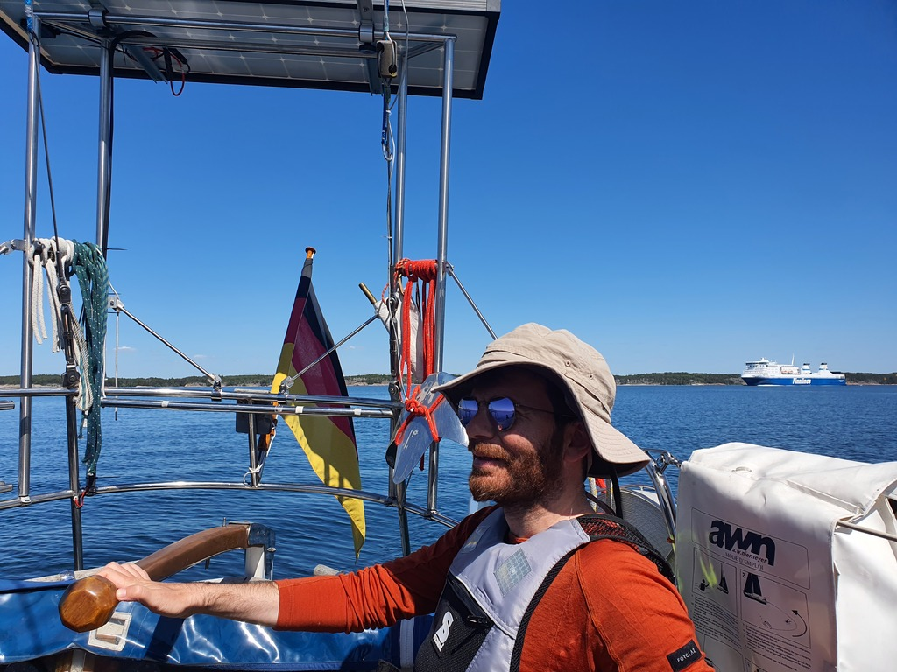
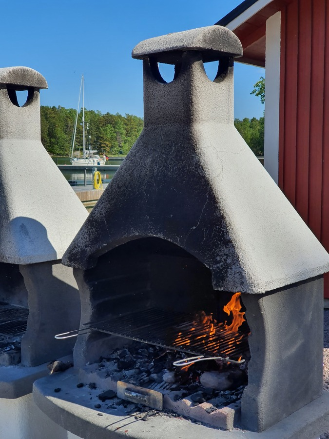

A no wind day. We slept late, and then hoisted the mudball of an anchor and sailed south across the Turku fairway to Nauvo. That's where we'd pick up Suski again.

At 1-2kt of speed the short trip took a while, but the sun was shining and there were no waves and minimal traffic. Nice relaxed day on the water.

 

Suski arrived to Nauvo just before us, and was there to catch our lines. This appears to be a posh beach resort for the local octogenarian crowd. The most expensive marina on the trip so far. But there is a grill place and a sauna, both of which we intend to utilise.

 

* Distance today: 7.3NM
* Total distance: 788NM
* Lunch: grilled halloumi, Finnish sausages, and potato salad
