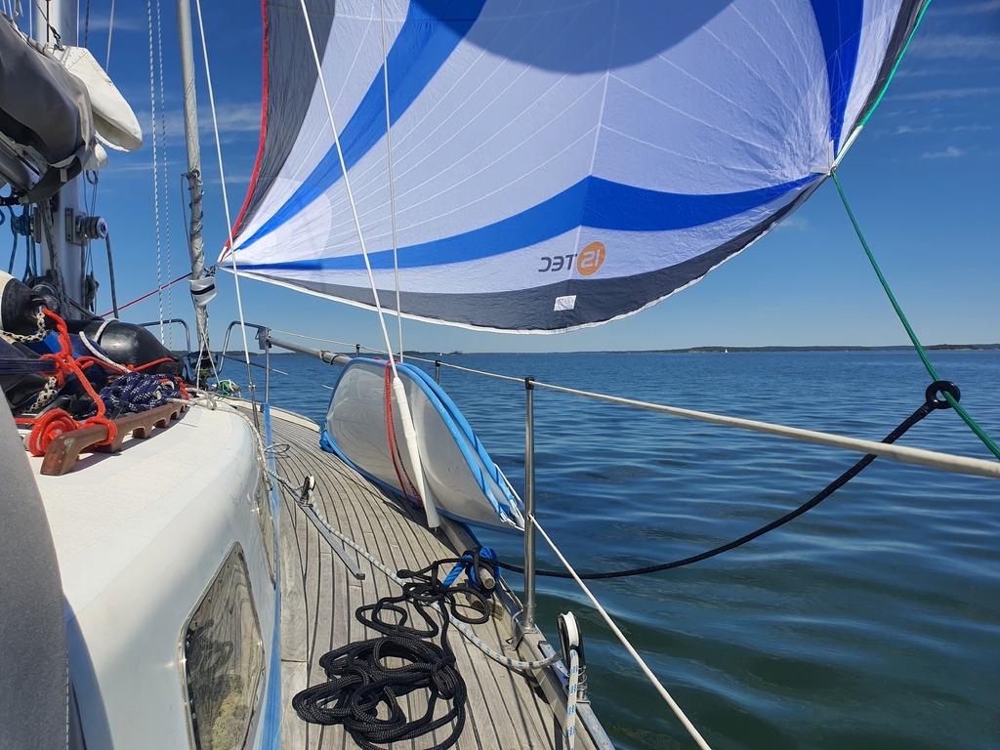
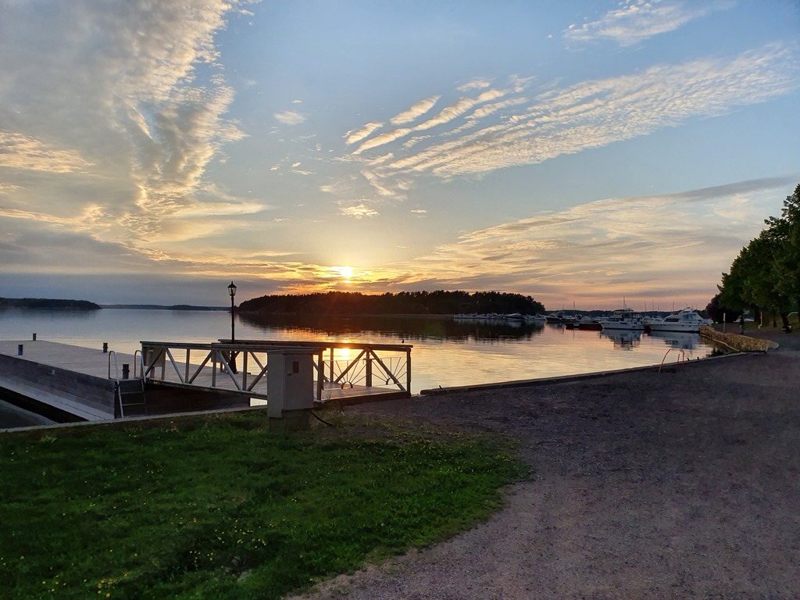

Forecast was looking great, a fast but comfortable beam reach at 10-19kt. But that sadly wasn't the reality. Instead, another low-to-no wind day.

 

But hey, chance to fly the Parasailor again! At some point we even went at the insane speed of 4kt. And then the wind died totally, so the last 10NM to Naantali went with the engine.

We cleared the Moomin Island and arrived to the town marina. Some family visits and white wine in the cockpit followed.

 

* Distance today: 23.7NM
* Total distance: 811.7NM
* Engine hours: 2.2
