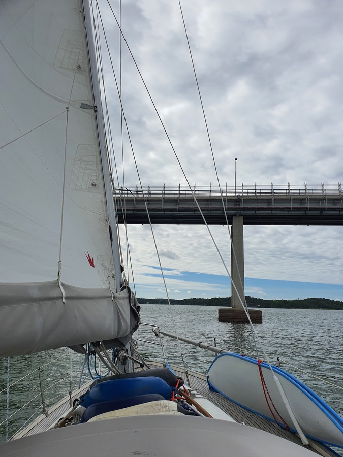

This time the wind forecast was on the spot, 10-19kt, from south when we were heading north, and then from west after we rounded the northern tip of Luonnonmaa and started heading south. Easy and fast sailing.

 

Today we just did the short hop to Turku. The plan was to stay at the Turku Yacht Club harbour on Ruissalo, but they didn't pick up the phone, and there was nobody there when we visited. So instead we motored up the Aura river to the center of Turku. Traveling in style, it seems.

 

* Distance today: 17.9NM
* Total distance 829.6NM
* Engine hours: 1.3
* Lunch: pea soup
