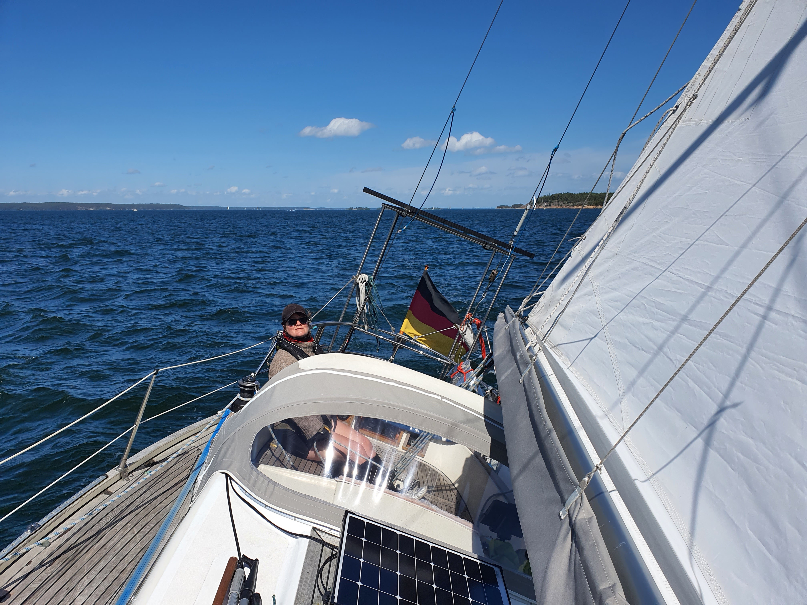

The first round of enjoying the company of friends and family is over and we retreated back to the archipelago to enjoy some anchoring. 

 

After checking that there was no traffic on the river Aurajoki, we backed out from our box and  headed towards Airisto. At Airisto we hoisted the sails and started tacking to south.

For the first time this season we saw as much sailboats as on a nice Havel day, though, the area of Airisto is maybe 100 times bigger! Everyone else was heading home after a weekend somewhere in the archipelago, and we got to be the annoying boat with right of way most of the time.

* Distance today: 22.4NM
* Total distance 852NM
* Engine hours: 1.3
* Lunch: rye bread and potato salad
* Dinner: spaghetti aglio e olio
