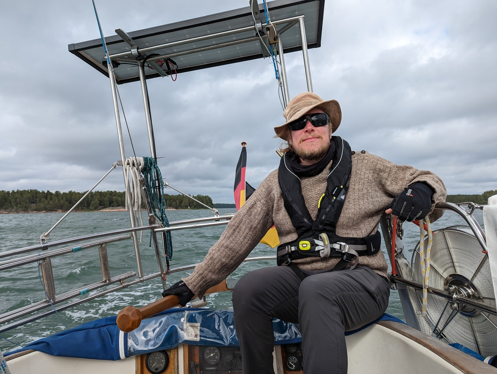
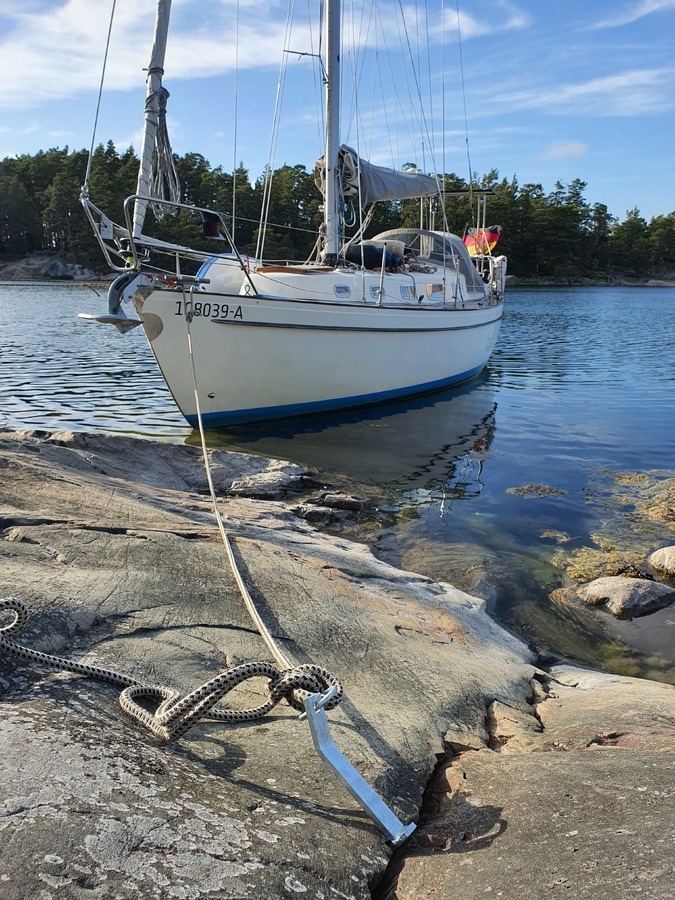
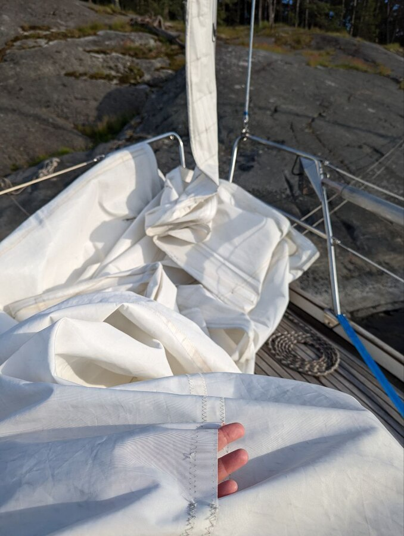

From our anchorage at Heisala it was just a short hop to one of the first nature harbours inside the Archipelago Sea Nature Park. With this in mind, we left only after Suski's workday, tacking upwind between the islands for a couple of hours.

 

This was our first chance to try the new rock anchors we got in Turku: this particular island doesn't have suitable trees, though in places there are fixed metal rings for boats to tie to. The summer season has really started, this is the first time we're sharing a nature harbour with other boats.

 

On the way in, we noticed that one of the seams in our foresail has failed, so time to fix it!

 

* Distance today: 7.4NM
* Total distance: 859.4NM
* Lunch: potato-pecorino patties and a tomato cucumber salad
