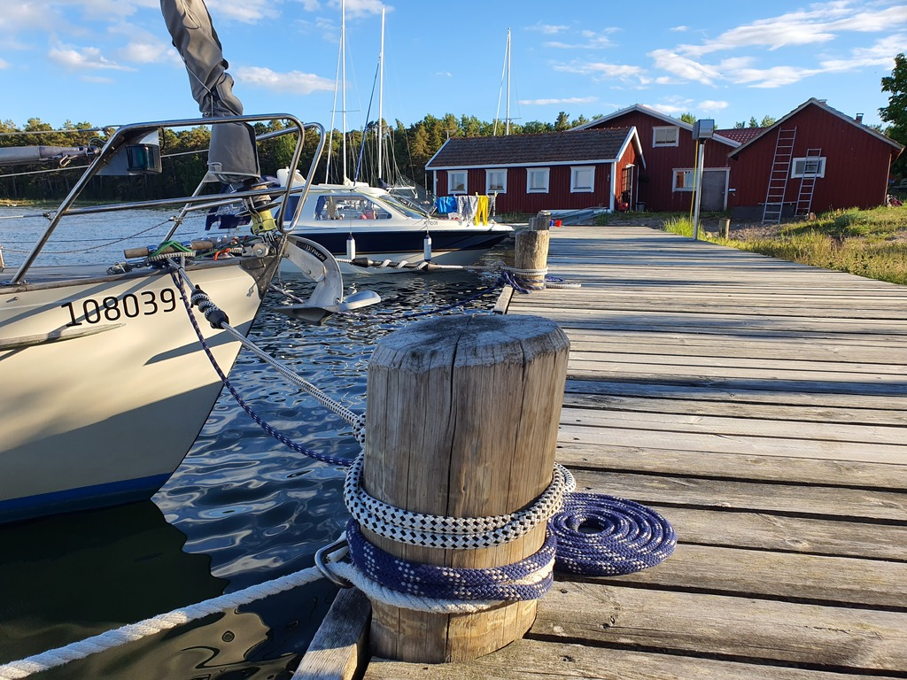

After a nice sunny day in the nature harbour, we hoisted anchor and sailed across to the tiny guest harbour of Helsingholm.

 

Sadly the sauna here is not operational at the moment, but we were able to fulfil our primary mission: smoked fish. The keeper of the guest harbour had just smoked a fresh batch today. Great stuff!

* Distance today: 6.2NM
* Total distance: 865.6NM
* Lunch: asparagus with sauce hollandaise
* Dinner: smoked fish and archipelago rye bread
