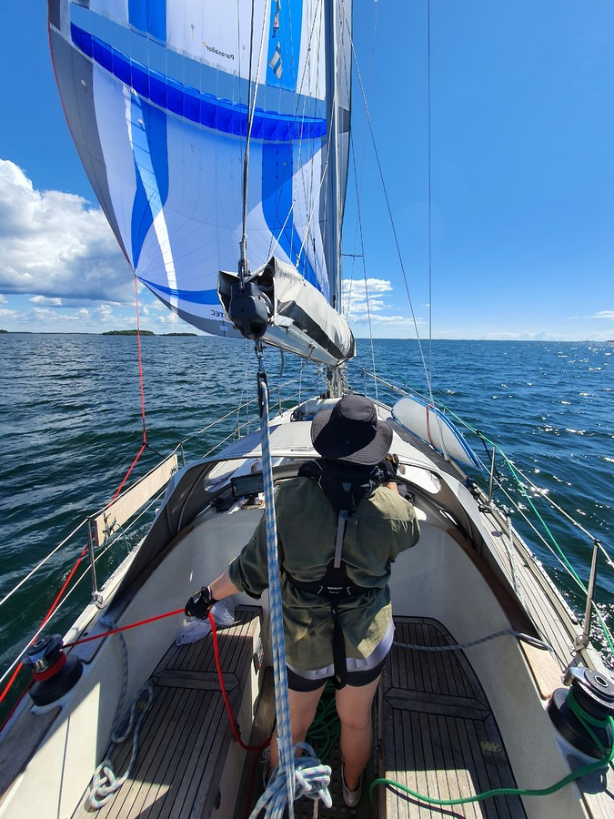
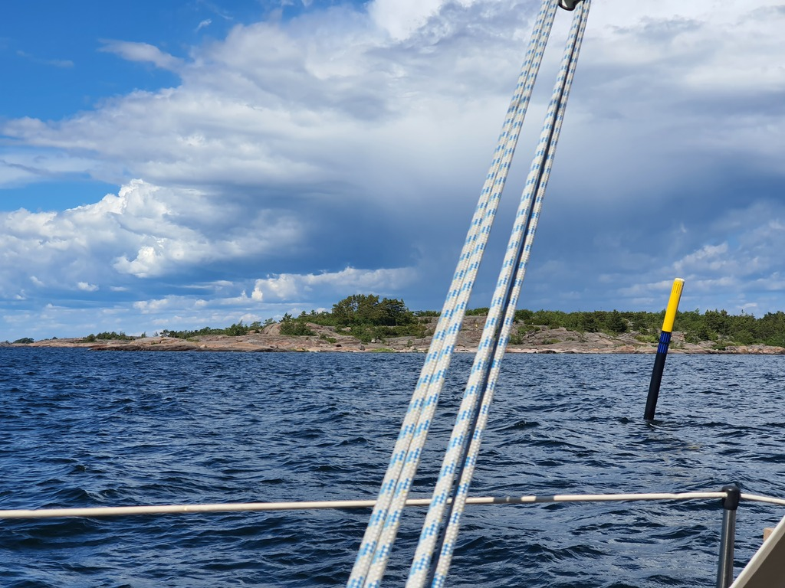

A lovely sunny downwind day. After morning routines we hoisted anchor at the scenic nature harbour, and headed back to the fairway. With the wind forecast, the Parasailor was the clear winner for the day.

 

Evading the ferry to Hiittinen, we spotted an osprey nesting on top of a fairway marker. Then a nice fast downwind sail. There were couple of bigger boats following with their carbon sails, but they couldn't catch us. The ride was smooth enough for baking bread while under way.

Nearer to Cape Hanko the fairway became narrower, and we switched back to the white sails for faster gybing. We passed the southernmost point of continental Finland under sail. Now we're in the Gulf of Finland.

 

Since there was a "luxury music festival for adults" in the Hanko harbour, we were happy we had already decided to continue on to the nice anchorage near the Tvärminne research station.

* Distance today: 31.5NM
* Total distance:  907.4NM
* Engine hours: 0.7
* Lunch: feta salad and fresh rye bread
