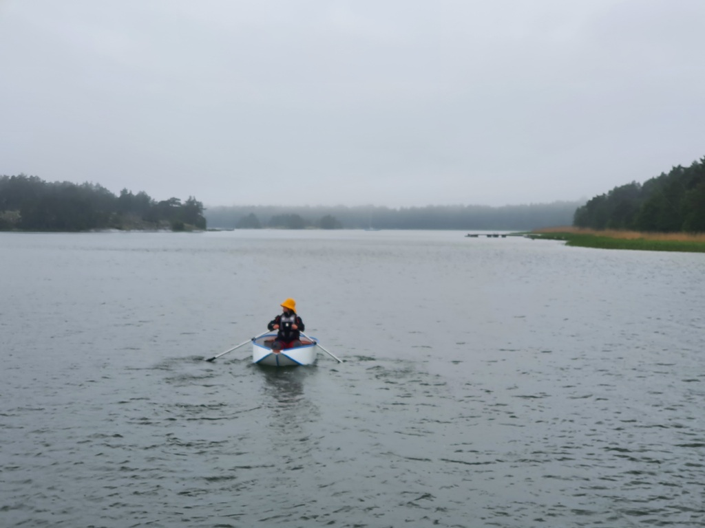

The day started with fetching our day sailor Annis from the shore. 

 

We did a round trip in the nearby archipelago. Thanks to the Finnish defense forces we got to enjoy some of the sail with lovely sounds of _BOOm, rätttättää and PUM_. This sail had a bit of everything. Wind from all directions and both small and big waves. 

 

For the evening we're tied up in the other end of the bay. Here in the south side there is a narrow segment deep enough for Scandic mooring.

* Distance today: 14.2 NM
* Total distance: 921.6 NM
* Engine hours: 0.6
* Lunch: Forest mushroom risotto
