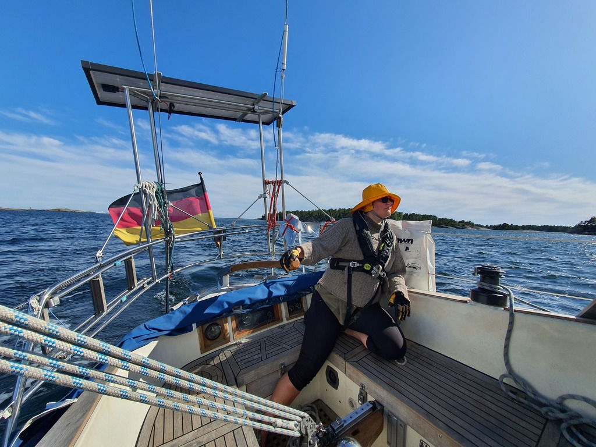

Sun again! We hoisted the FLINsail in the morning, and by afternoon the boat batteries were full.

A motorcycle brought us a lunch visitor: Rambo. After the meal we packed up the boat and had a pleasant quick downwind sail to the next nature harbour.

 

This one has a lot of convenient metal rings installed into the cliffs, but some of them have rusted through, so important to check before utilizing. This time were tied to one of them, and one of our rock anchors.

* Distance today: 8.5NM
* Total distance:  930.1NM
* Lunch: spaghetti Bolognese
