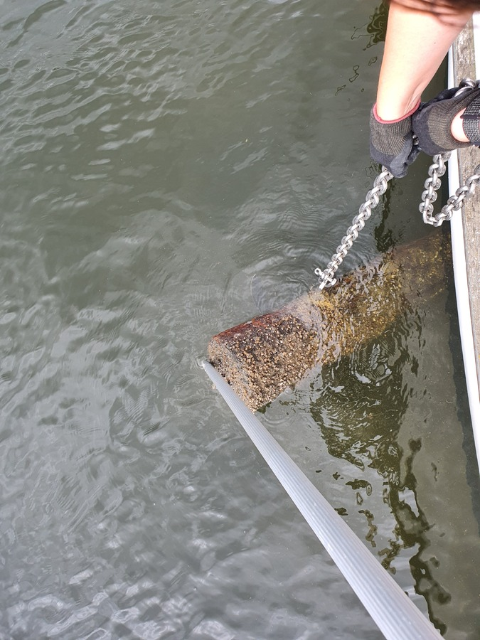
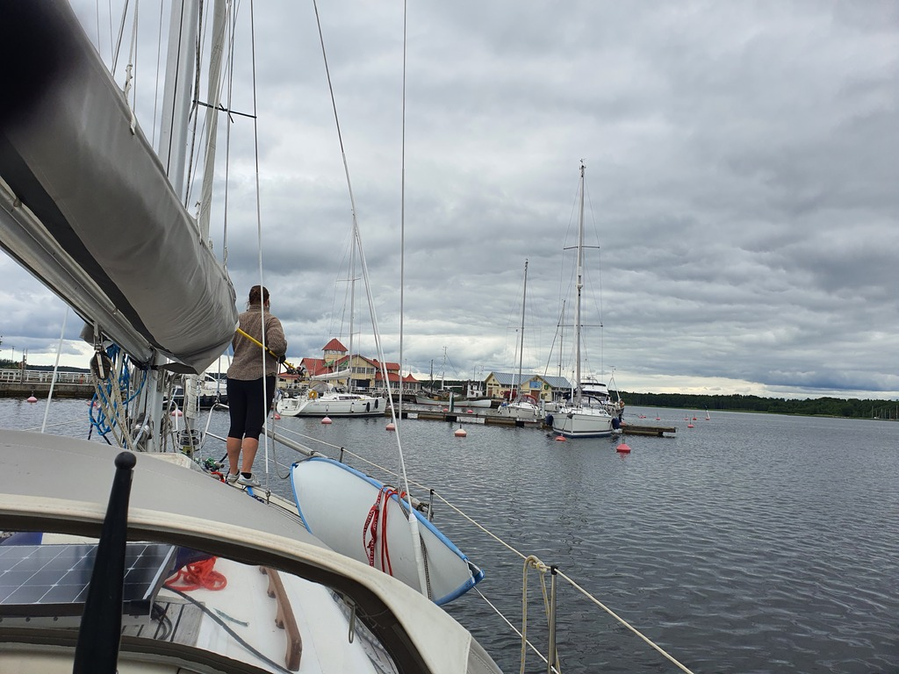

The morning's departure from the nature harbour turned out to be a bit trickier: our anchor had fouled on a huge pine log. Luckily we were able to dislodge it with the boathook. But this means the anchor likely wasn't properly set. Scary.

 

The short sail to the cute port town of Tammisaari was a slow one. Broad reach with 3-5kt of wind. But sometimes it is nice to just let the autopilot work and enjoy the scenery. Two ospreys flew over the boat.

 

In Tammisaari some provisions, and a visit to the local chandlery to acquire spare parts to fix things broken during the storm in Sweden. Next will be some family visits.

* Distance today: 6 NM
* Total distance: 936 NM
* Lunch: pizza
