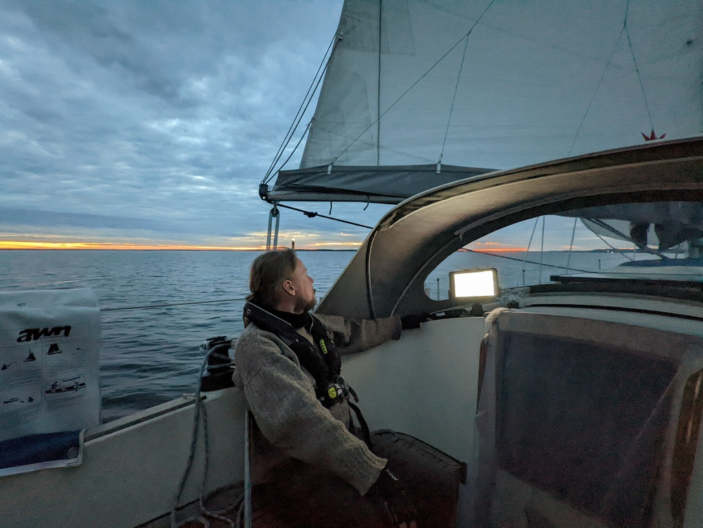
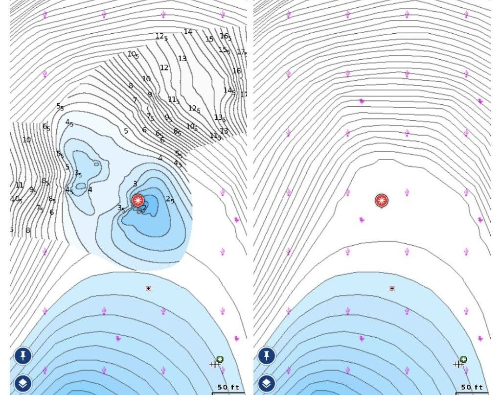

We decided to have a bit longer run today. We filled up the freshwater tank, and then left just before 11am. First was motoring upwind the narrow Tammisaari fairway, then sails up as soon as the space widened enough to start tacking.

 

Once we reached the main Helsinki - Hanko route, the wind was down to a slow but comfortable broad reach. Lots of traffic, but nearly all heading the opposite direction. It looks like all of Helsinki wants to be in the archipelago sea for midsummer!

Crossing the wider segment in front of Porkkala went quite smoothly. Light wind and very small swell, and no problem avoiding the shipping traffic from the port of Kantvik. We added a preventer to immobilise the main sail.

 

We chose an anchorage just south of Cape Porkkala, and reached it at midnight (this time of year the nights don't really get dark) Unfortunately at the entrance we also found an uncharted rock. Seems no major damage, but we'll inspect the depth of the suspected paint scratches tomorrow. And now the position of the rock has been submitted to Navionics.

_Our sonar trail on the left, the official nautical chart on the right. Chart says it should be 6m deep there_
 

* Distance today: 42.4NM
* Total distance: 978.4NM
* Engine hours: 1.3
* Lunch: Caesar salad
