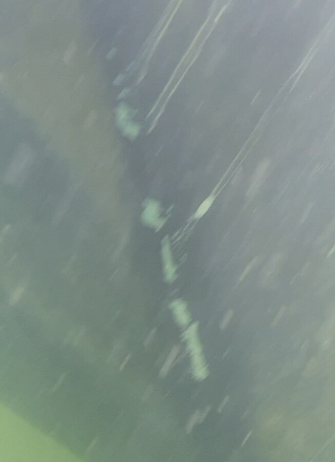
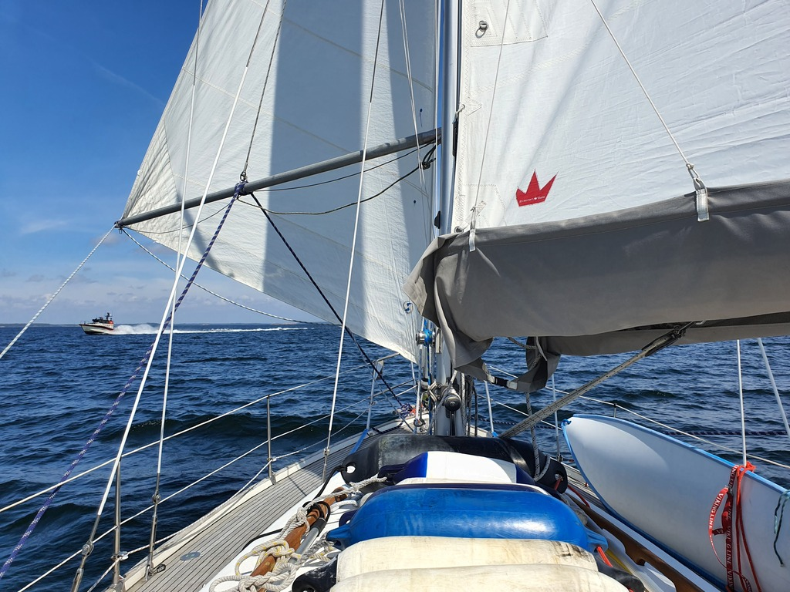

After morning coffee we checked the damage from yesterday. It is still a bit cold for diving without gear, so we utilized a highly advanced underwater camera rig (waterproof mobile phone taped to a boat hook). From the pictures it looks like only the antifouling was scratched.

 

Then it was time to go sailing. Today's course would be dead downwind along the Porkkala Cape. The Parasailor would've been a great choice, but we wanted to try the heavy-weather downwind setup of boom preventer and poled-out jib.

 

Compared to the Parasailor it is quite a lot more rigging to get it stable, and a lot more hassle to gybe. But the benefit is that it can be reefed, and it is easier to go from it back to the regular sailing setup. With the gusty conditions it was surprisingly fast. We even out-sailed a 33ft catamaran.

Now we're in a marina in Suvisaaristo where we were given an empty box as the locals are all away. Bergie used to live just across the bay from here, many years ago. Adventures will continue after the Finnish midsummer weekend.

* Distance today: 20.2NM
* Total distance: 998.6NM
* Engine hours: 0.6
* Lunch: feta avocado salad
