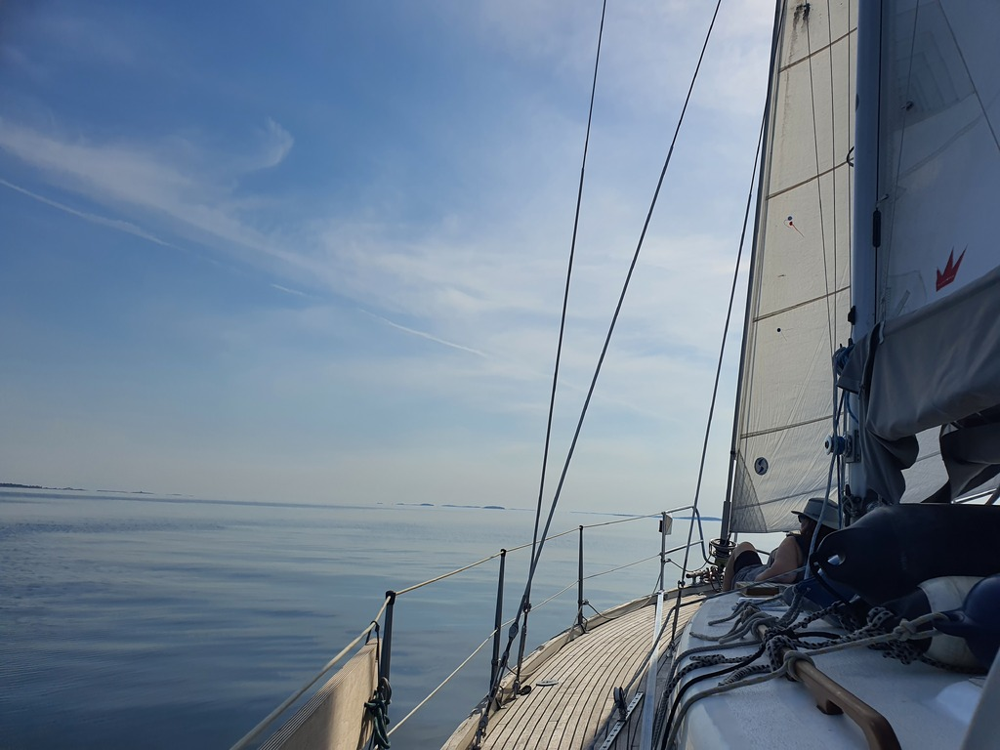
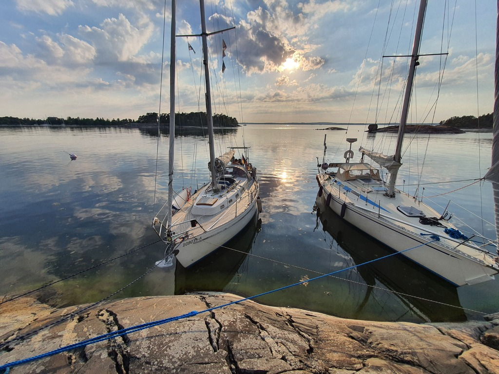

After a decadent midsummer, we collected our additional crew, acquired some smoked salmon, and headed out. Summer is totally here, the harbour was hot and humid. The light winds only brought slight relief.

 

We did a slow but pleasant passage following the side of Cape Porkkala. Eventually the wind died, and one after another all sailboats out on the fairway decided to become motorboats.

 

We also dropped sail and motored to the nearby nature harbour of Bylandet. This is a recreational island owned by the City of Espoo, and so we could tie an aft line to a buoy instead of dropping an anchor. Some swimming and sundowners followed.

* Distance today: 14.3NM
* Total distance: 1012.9
* Engine hours: 1.1
* Lunch: mushroom salad and smoked salmon
