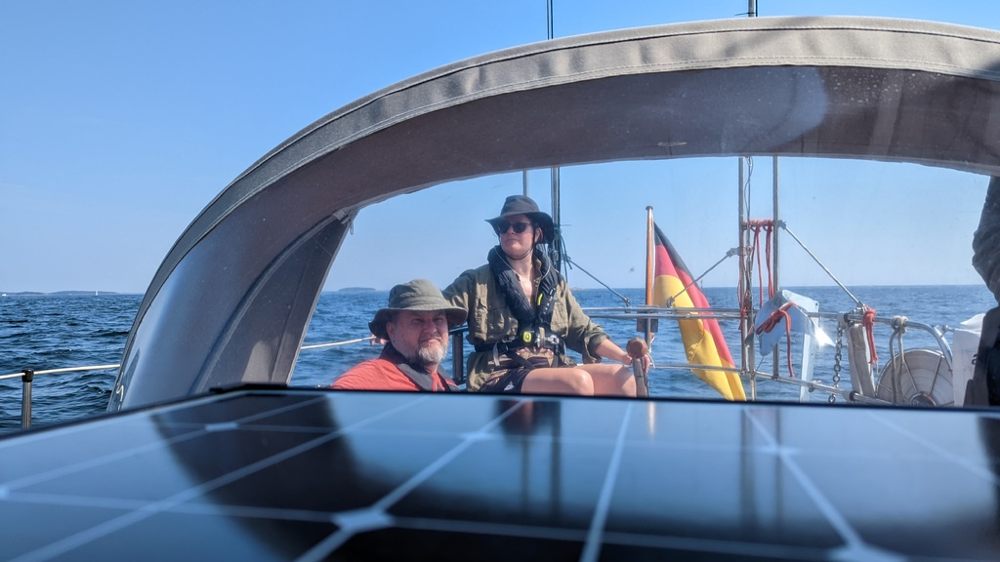

Morning started with a bit of island exploration and breakfast. After that, we motored out from the bay and hoisted the sails. Downwind past Porkkala and Upiniemi, over the Porkkalanselkä with 20 knots of wind behind us. Poling out the fock again. 

 

_"It's insane, let's do it"_ were the words accompanying the decision to go to Elisaari. The approach is marked in Navionics as too low. The official Finnish charts say nothing about the depth, so we decidey to rely a article in a Finnish boating magazine and a random forum thread about it from 2005.

 

You pass the island of Elisaari from the north and use the Bärosund fairway. After the last green marker past Stångholm you turn east. The only advice I can give is to stay dead center in the channel between the reeds. With this we saw at lowest 2.2m in the depth sounder. At the harbour it is deeper. We were advised that every buoy is deep enough if you have made it so far!

Now it is time for some lunch and we booked the sauna for 9 to 10!

* Distance today: 24.9 NM
* Total distance: 1037.8 NM
* motor hours: 1
* lunch: wild mushroom risotto
