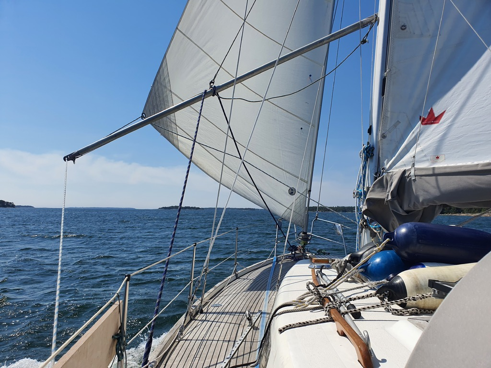
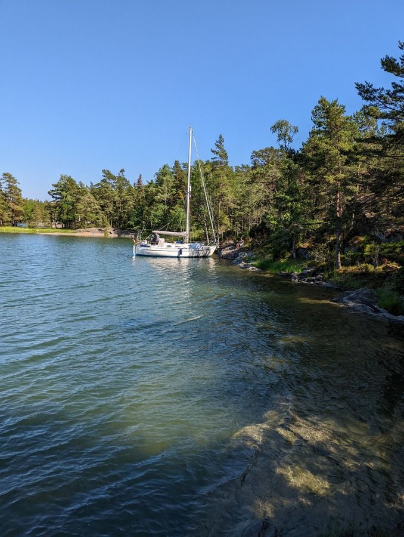

After two days of sauna, good food and nature trails, it was time to leave the pretty marina of Elisaari behind. Again motoring through the reeds, then sails up, and on a broad reach through the scenic Barösund straits.

 

Another fast sailing day. It was rare to see a speed over ground less than 6kt. We poled out the jib, and with that were substantially faster than the other sailboats, most going under the genoa-only setup.

 

In the Ekenäs National Park we picked the natural harbour of Modermagan. This sheltered spot was reputedly already used by Vikings on their way to Constantinople.

* Distance today: 19NM
* Total distance: 1056.8NM
* Engine hours: 0.6
* Lunch: spaghetti Bolognese
