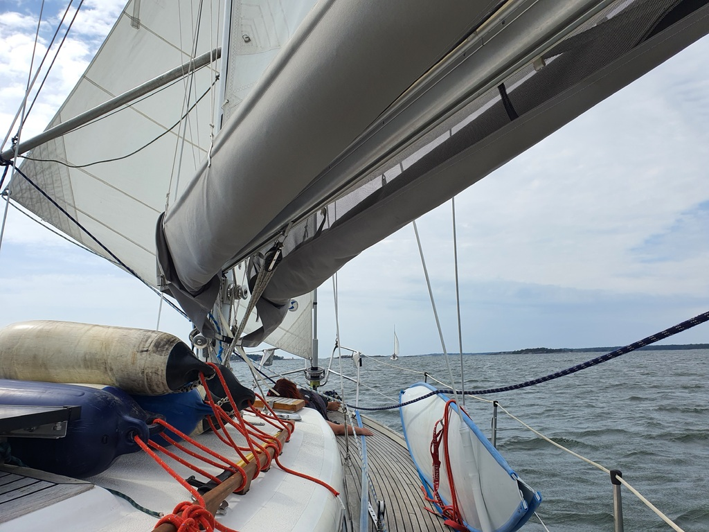

We slept late, as we knew that the reserved spot on Hanko marina would not be available before 14:00. We carefully navigated our way between the underwater rocks back to the fairway and hoisted the main. After a while we also poled out the jib on the other side and continued overtaking sailboats in front of us with the only genoa setup. Our Lille Ø is a fast boat with over 15 kt winds!

 

We reached Hanko in bit over 3.5 hours. And as tradition dictates, we had the fastest winds of the day for the harbour manouvers. Good thing we start to have some experience already. Now, some Classic Pizza and city marina exploring.
