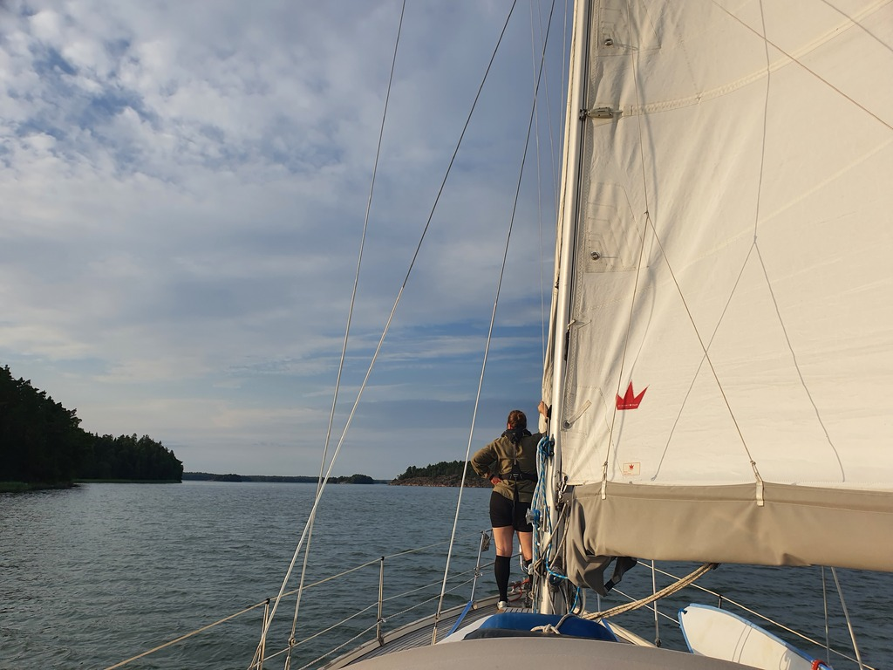

_For the Finnish readers: not the Strömsö you're thinking of_

Having spent a fun night out in the "sailing capital of Finland", we started the day with laundry. Then we left the harbour and hoisted sails ... and the wind died immediately. Instead of the forecasted 13-18kt, we had 1kt. Since there was some swell, we left the mainsail on to stabilise and hoisted the motorsailing cone.

After crossing the Tammisaari fairway, the wind picked up and we were able to sail, starting with beam reach and then with poled-out jib wing-on-wing.

 

We picked the sheltered bay of Ryssvik on Strömsö for anchoring.

* Distance today: 29.5NM
* Total distance: 1101.9NM
* Engine hours: 3
* Lunch: feta avocado salad
