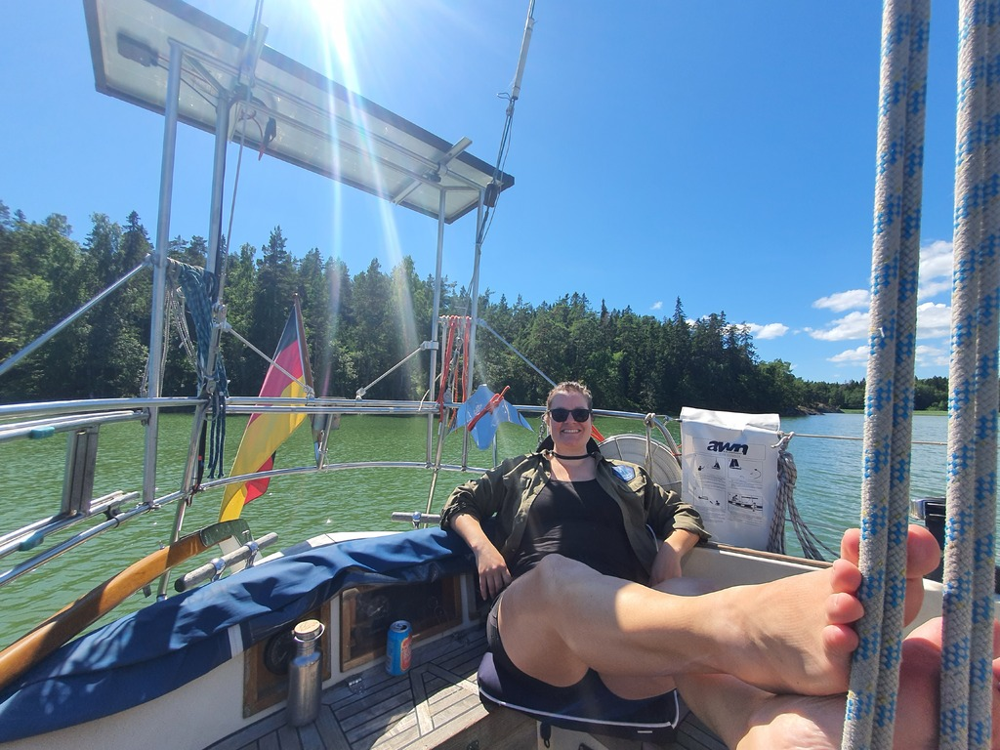

In the morning we motored to the Barösund fuel dock. Here we could fill up the boat (less than 1l spent per day since mid-May). Karin and Daniel were able to catch the bus to Helsinki from there to make it to their flight tomorrow.

After that we had a slow lazy sail with only the main up around the island of Elisaari where we picked the nature harbour of Skatafladan. Sadly there is a new summer cottage blocking the only spot for Scandic mooring, so we're again swinging on bow anchor.

 

* Distance today: 8.2NM
* Total distance: 1101.1NM
