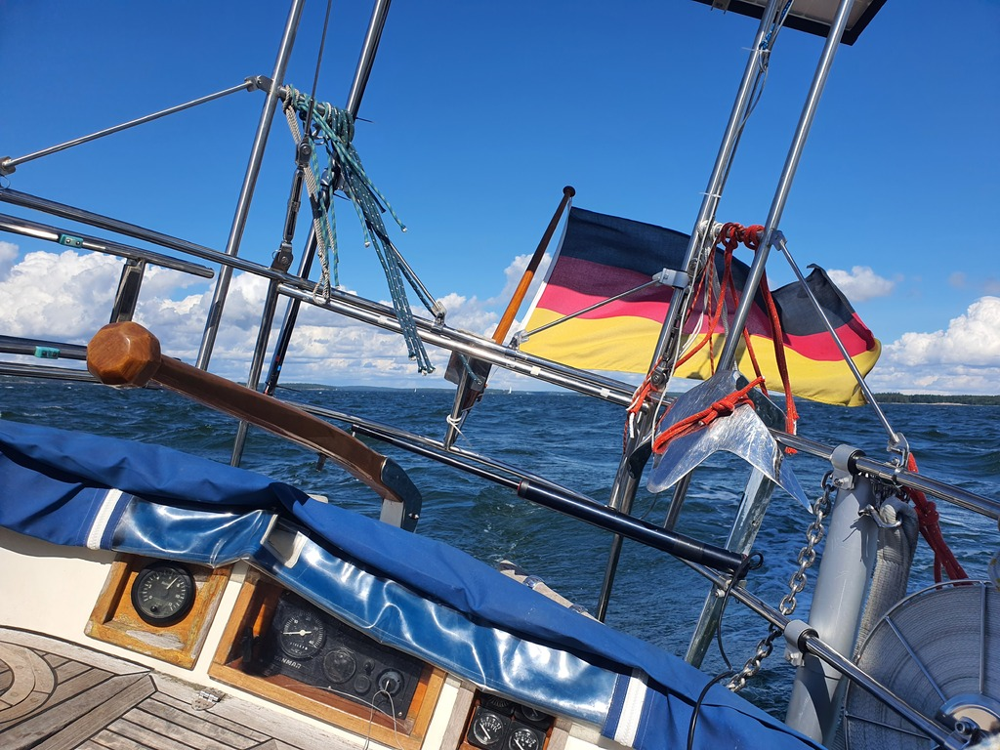

After a day of no wind the tables were turned and today we had on average 25 knots with gusts up to 30 knots. Broad to beam reach, no reefs and we were flying! We broke the speed record again, now the highest recorded speed is 8 knots! Lille Ø is a sturdy and reliable high wind boat!

 

We're now tied up in one of Espoo's outlying recreational islands. The wind is raging just few boat lengths behind us, but here it is sheltered. There are some trails to explore, and maybe even a sauna for later.

* Distance today: 27.8NM
* Total distance: 1128.9NM
* Engine hours: 0.8
* Lunch: forest mushroom pie
