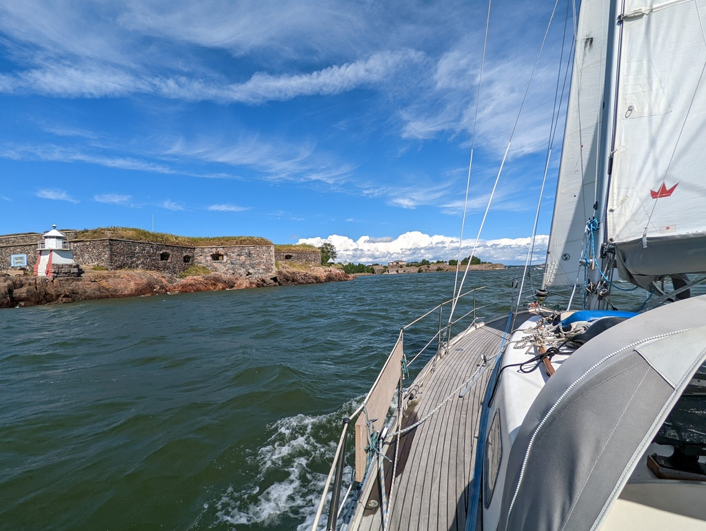
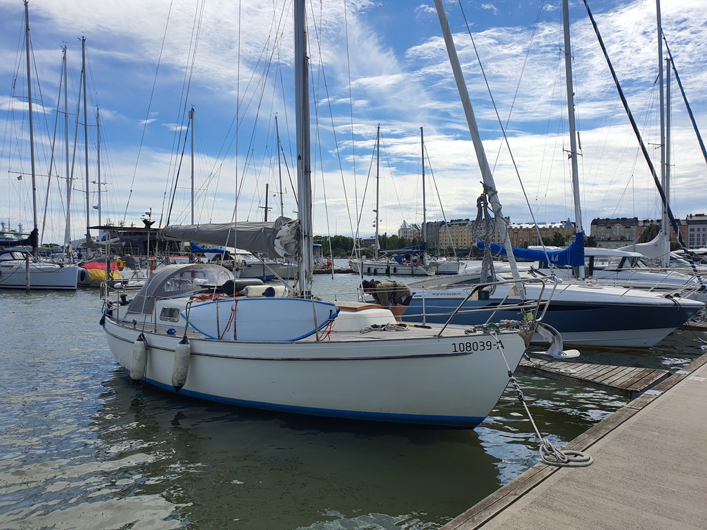

The island of Gåsgrundet was packed with boaters, and the communal sauna evening was a lot of fun. In the morning we had breakfast, and then left the pier.

 

We approached the Harmaja lighthouse on a quick beam reach, checked AIS for any major shipping traffic, and then gybed to the narrow Kustaanmiekka strait running past the Suomenlinna island fortress. Gorgeous place to sail, but it could get hectic to meet one of the big ferries to Sweden here!

 

We dropped sails in the lee of the Finnish icebreaker fleet parked at Katajanokka. High winds for the harbour manoeuvre as usual, but we're now safety in a marina in Helsinki Pohjoisranta, near where the classical tall ships live. We'll be here for the rest of the week for some social visits and logistics.

* Distance today: 11.8NM
* Total distance: 1140.7NM
* Engine hours: 0.4
* Lunch: meatballs and potato salad
