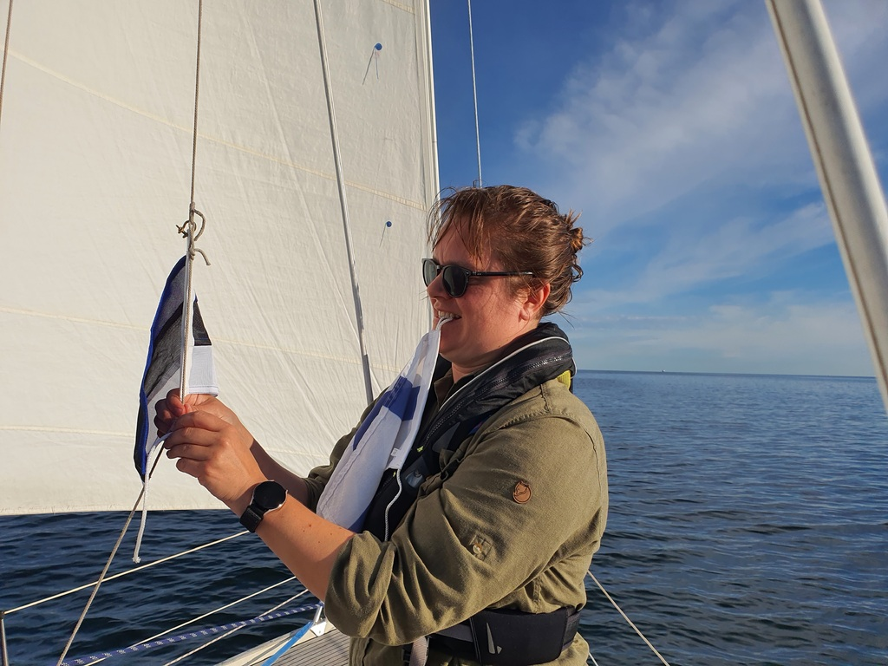

We started our Monday with doing the groceries at the Hakaniemi market. Fresh vegetables and some local fish was acquired. We had a late start as the morning was completely windless. We hoisted the sails right after the marina and tacked our way south towards Kuninkaansalmi, where we managed to tack through the narrow fairway towards the open ocean. With very light winds we were aimlessly sailing towards Porkkala. Somewhere north of Isosaari an new plan started forming and for the lulz we routed us towards Tallinn. Expected arrival at 4 am, not that bad, we thought.

So we headed south, got the grib files and weather routed us to Tallinn. After checking that Navionics had download enough of the surrounding sea area we  were on our way! It's nice to have a boat equipped so, that you have all the necessary equipment and food onboard to just go when the weather looks good.

 

Weather worked out like planned with slow headwinds at the beginning, around 2-5 knots till 2000 from west and then increasing north winds for the night. We sailed with ever increasing speeds so well, that our arrival time started to look like 1:30 instead of 4 am. On Suskis watch she rolled in the jib to reduce speed and on the watch change and negotiation with Bergie also the main was reduced to first reef to be able to delay our arrival to meet mornings first sun beams.

 

We managed to do exactly that. Tallinn Old City Marina is located behind the ferry harbour and you are required to ask for entry permission from Tallinn Radio 5 at channel 14. We called in at 3:30 and got permission to enter. I think arriving at night was good, as all the ferries were securely moored with no intention of leaving. The turn bridge in front of the marina was opened after a second call with VHF and we picked the first empty slot with boom mooring, tied up and went to bed. Bergie put the alarm for 8 when the harbour office opens and checked us in. Now at noon, we are having our morning coffees and planning our day exploring Tallinn!

* Distance today: 49.9 NM
* Total distance: 1190.6 NM
* engine hours: 0.5
* lunch: new potatoes and smoked salmon
