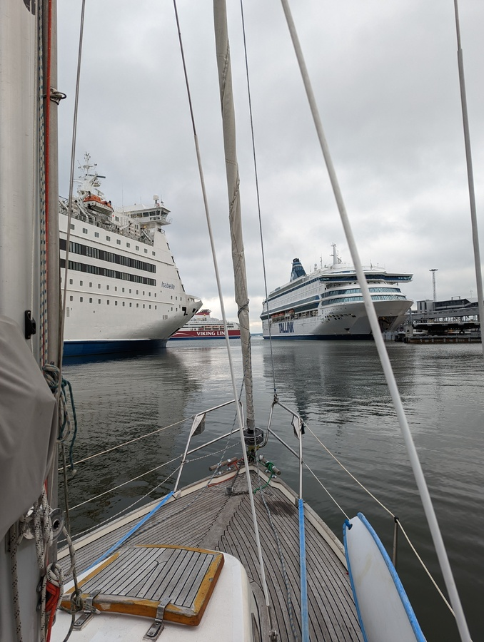
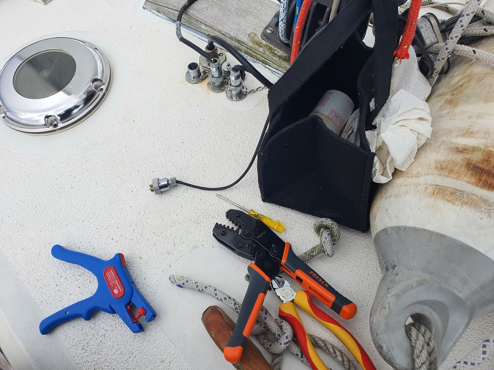
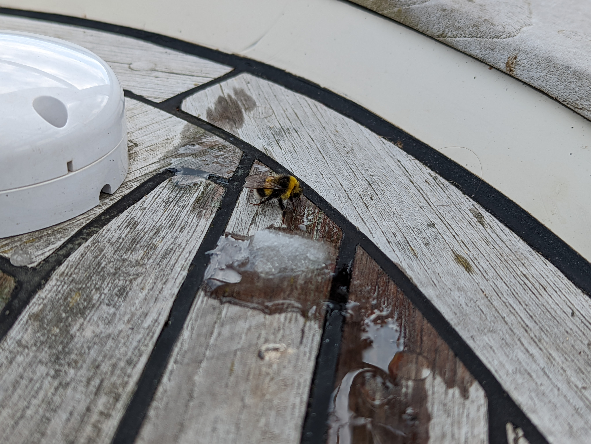
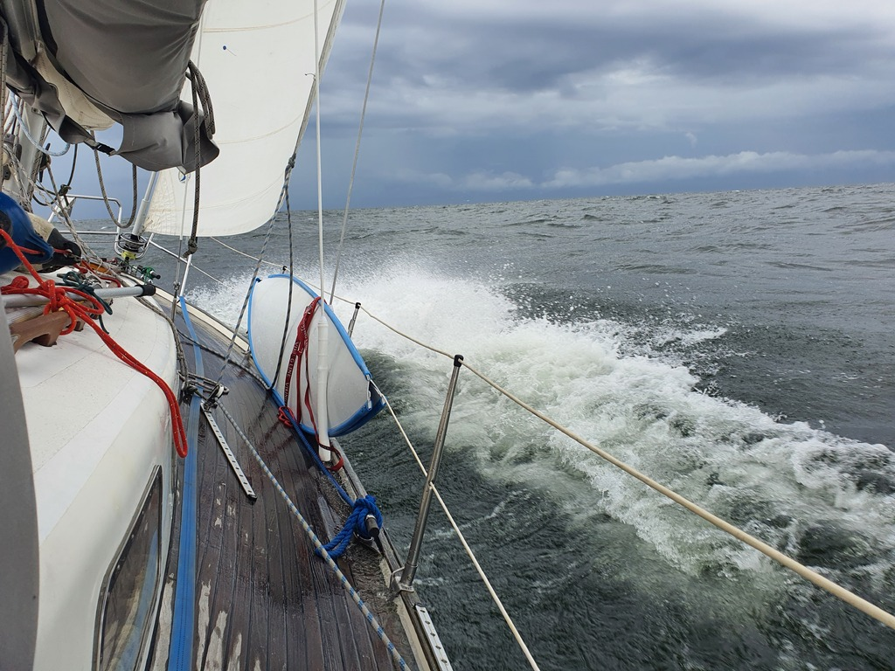

The trip to Tallinn was fun as always, some great museums followed by a feast in Olde Hansa!

In the morning we called Tallinn traffic on VHF and got the permission to leave behind Viking Xprs. We got out of the mooring and tied alongside to wait for the harbour bridge. Then through the main port and towards Finland alongside the traffic separation scheme.

 

We followed the route suggested by weather routing. West of Naissaari our comfortable 10kt wind on the beam died down, and we bobbed around for a while. At this point we also rewired the wind sensor that had been broken at the harbour manoeuvres. We really should install a better through-deck connector.

 

After a while a west wind started building up, and we were on our way, close reaching towards the Finnish coast. The aim was to get back to the archipelago region. The new wind brought with it a cloud of insects, despite us being quite far from the shore. Butterflies, wasps, ladybugs, and even a bee that we fed before it left on its merry way.

 

As the wind kept building up, we were soon barreling into bigger seas and heavy rain showers. No matter, Lille Ø can take it. Though cooking lunch was somewhat difficult as our stove isn't gimbaled.

 

When we got past the main traffic lanes we made the decision to head for the island of Jussarö. It is the furthest out island in the Tammisaari national park, and should contain some things to explore. We arrived to the island through a pretty narrow and rocky fairway, and will stay here for two nights as we'll meet some boating friends tomorrow.

* Distance today: 47.2NM
* Total distance: 1237.8NM
* Engine hours: 0.6
* Lunch: risotto with sun-dried tomatoes and smoked salmon
