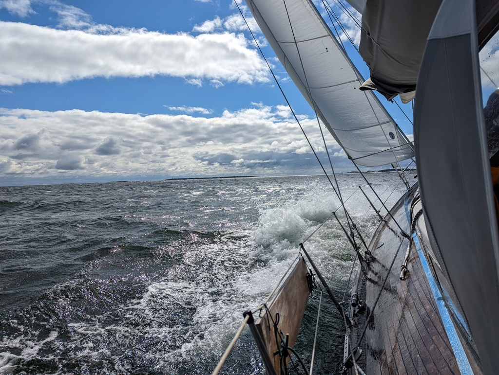

Jussarö was a mixed experience. High west winds are not your optimal Jussarö winds, and so most of the day we were on chafe watch duty, fixing issues on our and neighboring boats. In the evening the winds died and we had a chance to experience the local nature trails. First blueberries of the season, followed with some grilled halloumi.

We started early in the morning with next to no wind sometimes wondering how we are moving at all. We were heading west, with winds from west, so today was a proper workout day. 

 

Todays conundrum has been our digital compass, it has a misreading of 20 degrees. I believe it is time to recalibrate it with driving 2 circles. We did not want to do it near Jussarö because the island itself is a gigantic iron-based anomaly and in the afternoon near Hanko we had too much wind and waves to make it comfortably. 

*Distance today: 26.4 NM
*Total distance: 1264.2 NM
* Motor hours: 0.5
* Lunch: New potatoes with chanterelles and smoked reindeer
