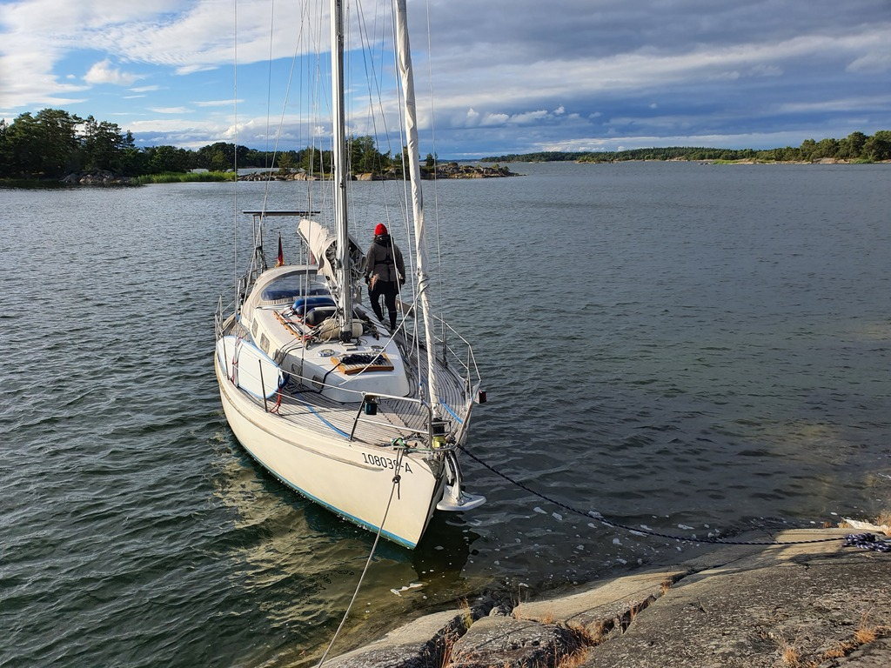

Due to bad weather we spent two fun days with our buddy boat's crew in the "Monaco of Finland" (as Karo coined it). But today it was time to press on. Still pretty high headwind, but definitely better conditions than yesterday.

 

We used the last chance to grab some Classic Pizza from Hanko, and then started tacking west past the Cape and towards the Archipelago Sea. Big splashy waves, but still pretty good progress. Way better sailing than the leg from Jussarö.

 

Just as we entered the Archipelago Sea National Park, the sun came out and the weather started feeling more like summer again. We picked a nice nature harbour just east of the island of Hiittinen, and got to use our rock anchors again.

* Distance today: 26.1NM
* Total distance: 1290.3NM
* Engine hours: 0.7
* Lunch: pizza
