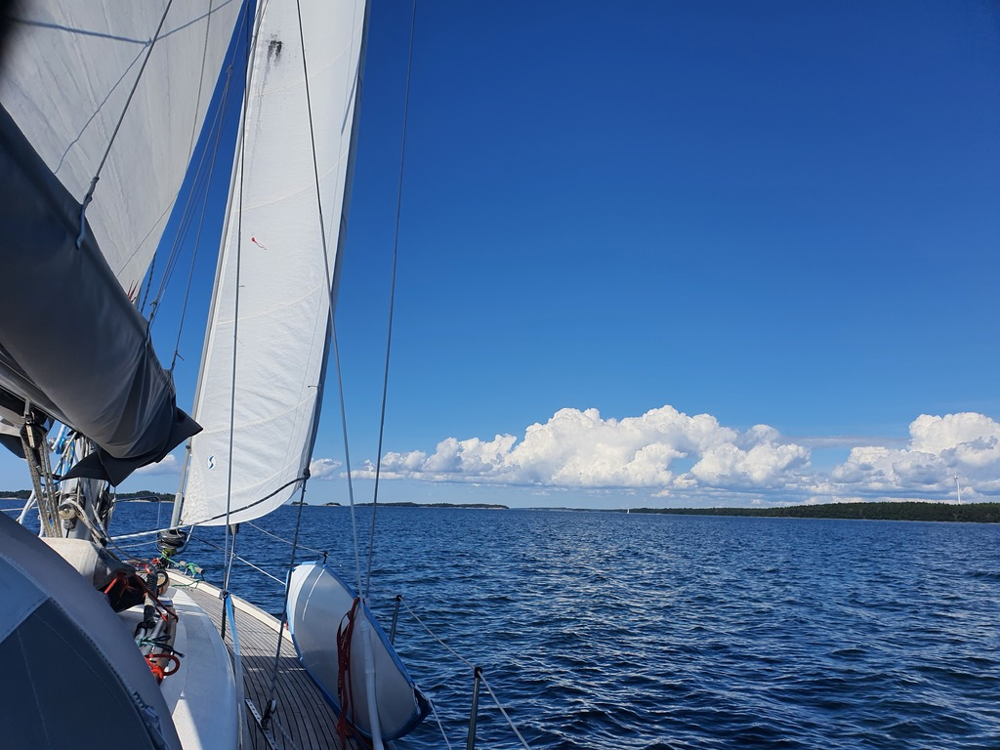
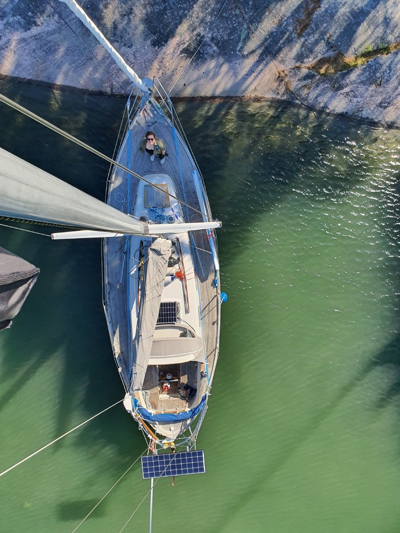

After an island exploration day, it was time to sail on. Another headwind day was on the menu, but this time with reasonably light winds and no waves.

We hoisted anchor and sailed back to the main fairway with a very light breeze. Then we decided to use the light conditions to our advantage and recalibrated our electronic compass by driving a couple of circles. As we tacked on, it became apparent that this fixed our wind sensor readings on the port tack, but not on starboard.

 

We sailed out of the Hiittinen island chain and into the Archipelago Sea proper. What a beautiful day to sail! With a near gale in the forecast for the evening, we picked one of the extremely well protected nature harbour out of the dozens available, and arrived into the narrow strait between the two Benskär islands. Others had clearly gotten the same idea, and for the first time on this trip we're sharing an anchorage with eight other boats. No problem, plenty of space still left.

 

Since the anchorage was totally calm, we decided to take the opportunity to continue wind sensor debugging. This meant climbing the mast and checking the sensor itself. And indeed there was a spider's nest and a big fat angry spider camped inside it. Let's hope their eviction fixes our readings.

* Distance today: 18.8NM
* Total distance: 1309.1NM
* Engine hours: 1
* Lunch: smoked reindeer and fried potatoes
