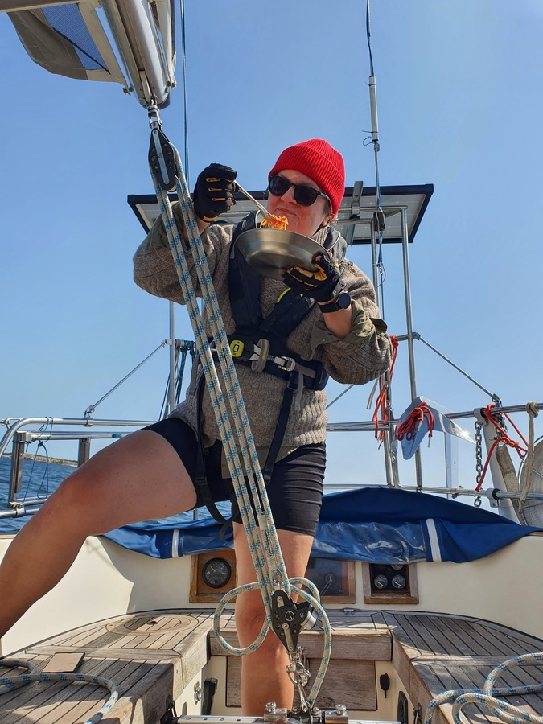

We left early to avoid the winshift to west. We headed avay from the marked fairways into the lovely nature park of Saaristomeri. The wind shift came way earlier than expected, so we made our way tacking between the islands and skerries.

Lunch was made under way with only minor complaints that the pasta sauce had hard time staying on the pan. One more winter project waiting for us in Berlin, a gimbaled stove!

 

The entry to Byviken in Björkö is extremely narrow and the depth gauge showed only 2.2 meters at the lowest point. We knew to expect a busy bay but we were completely unprepared for the amount of boats. Luckily we found a slot between 2 boats and dropped our anchor at 11 meters of depth! The bay itself is deep, only the entrance limits who can enter.

 

* Distance today: 27.6NM
* Total distance: 1336.7NM
* Engine hours: 0.9
* Lunch: spaghetti alla pomodoro
