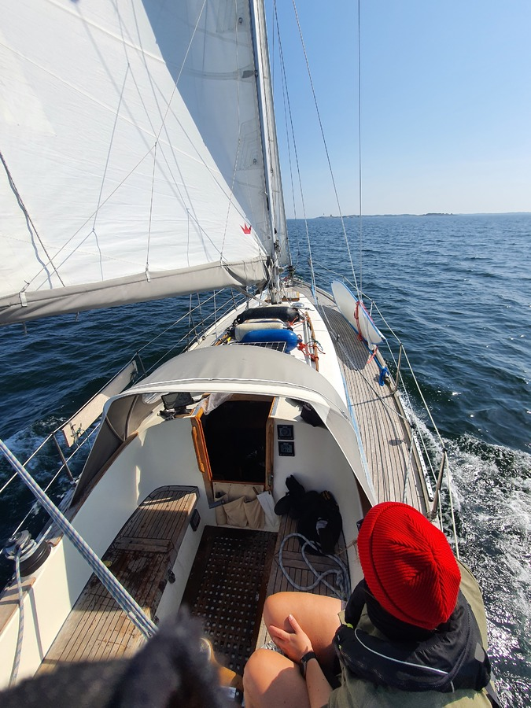
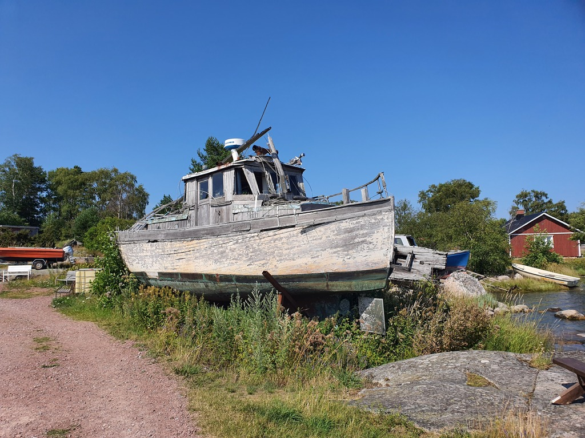

In the morning we left the picturesque but packed lagoon at Björkö and started our trip east. What a beautiful sailing day! 10-12kt of wind on the beam and an easy fairway to follow. Until now we've seen the locals mostly motoring, but today everybody was out sailing.

 

We pulled in early to the island of Vänö to catch up with our buddy boat. The small guest harbour was almost full already at 1pm, and squeezing ourselves to one of the last boom moorings was tricky. Suski managed to pull off a very tight full turn of the boat in extremely small space and side wind. On the second approach everything went smoothly.

 

The early arrival gave us a lot of time to hang out with our buddy boat crew, and enjoy a relaxing island sauna.

* Distance today: 18.4NM
* Total distance: 1355.4NM
* Engine hours: 0.8
* Lunch: pea soup
