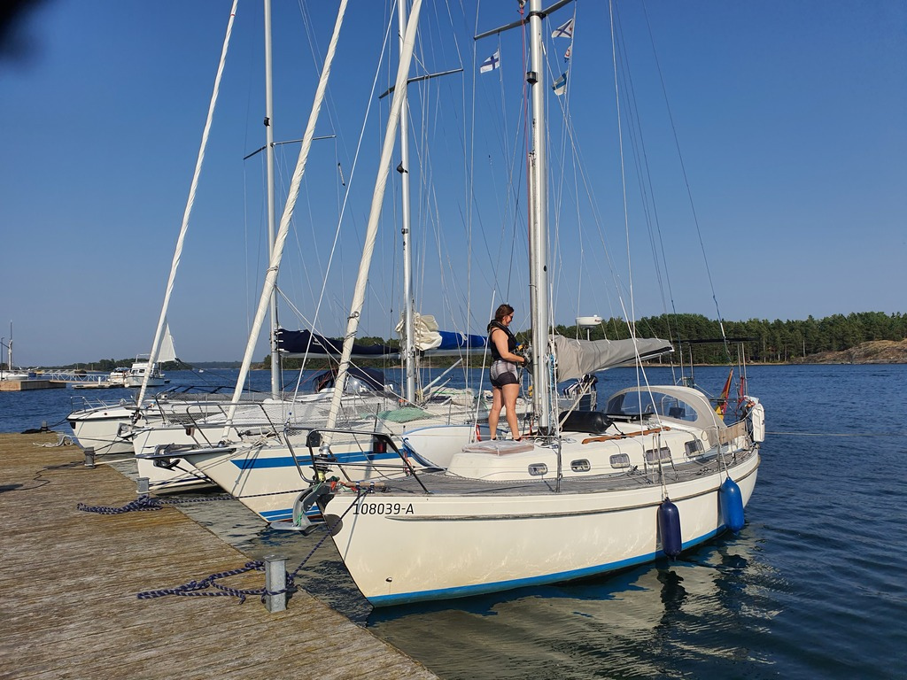

We had a slow morning in Vänö. After coffee, our buddy boat left for the fortress island of Örö. Our route was for the busy marina of Kasnäs where we'll pick up crew tomorrow.

There was a pretty nasty side wind into the narrow marina at Vänö. For our buddy boat we were able to ease their departure with some shore lines. But sadly that wasn't possible for Lille Ø. While making the turn to head out, we found a rock in the harbour. Luckily at effectively no speed.

The sail to Kasnäs was an easy lazy broad reach. Very few boats out compared to yesterday. Tomorrow we'll run some errands and then head out again.

