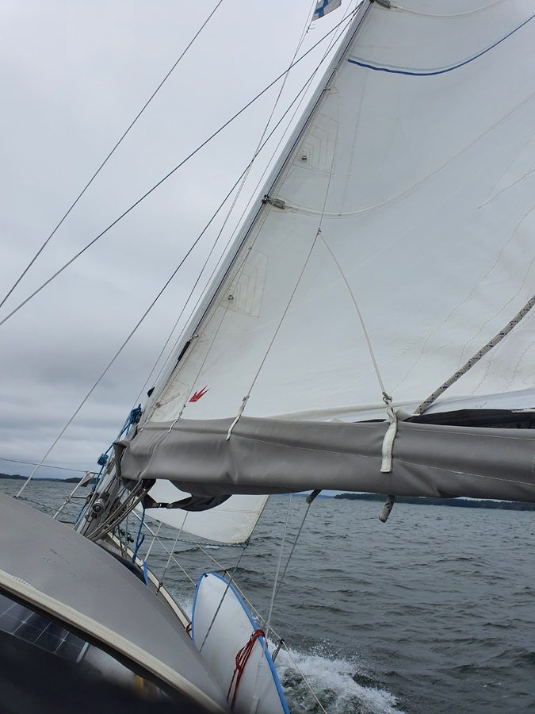
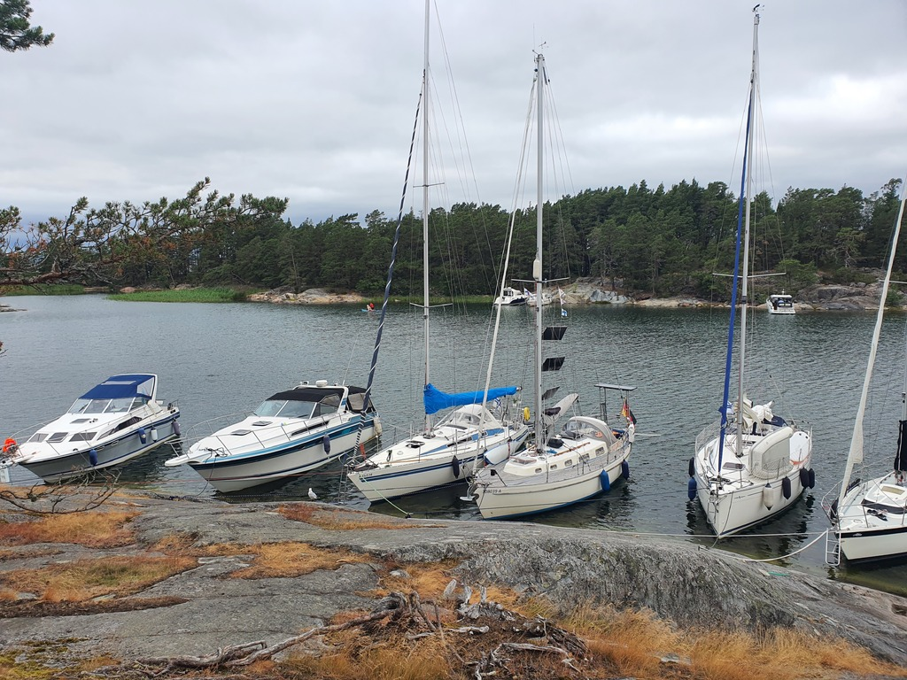

Our weekend crew arrived at 10, we did a short safety briefing and did a rope assisted side wind departure from the buoy. Sailing was fast and half of the way was also practically with no waves. 

 

Both Riikka and Arttu took shifts steering and we were in our destination swiftly.

 

* Distance today: 14.5
* Total distance: 1380.3
* Engine hours: 
* Lunch: potato and feta salad.
