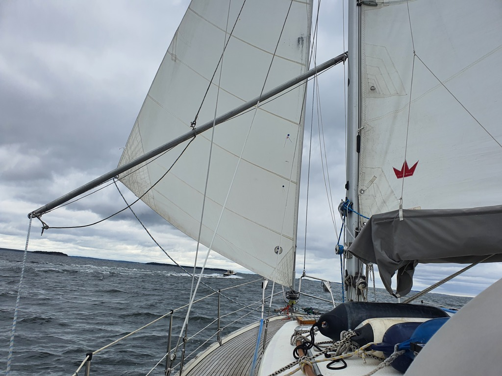

After a fun evening in the nature harbour, it was time to return our guest crew to their car. We enjoyed breakfast, and then hoisted anchor. This was probably the worst ball of mud we've had to clean so far!

The sail itself was a nice downwind run. We went most of the way with a poled out wing-on-wing setup yet again.

 

Kasnäs marina was absolutely packed when we arrived a 3pm, with even multiple boats tied to the outside of the wave break. We prepared to do a quick crew drop at the fuel dock, but then a boat decided to leave and we were able to squeeze in.

Tomorrow we'll continue the trip east.

* Distance today: 15.7NM
* Total distance: 1396
* Engine hours: 0.7
* Lunch: pizza
