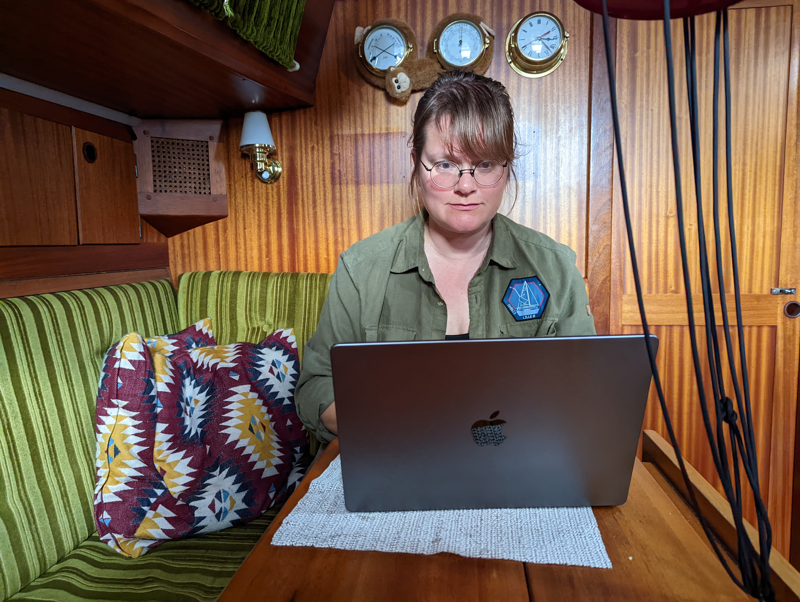
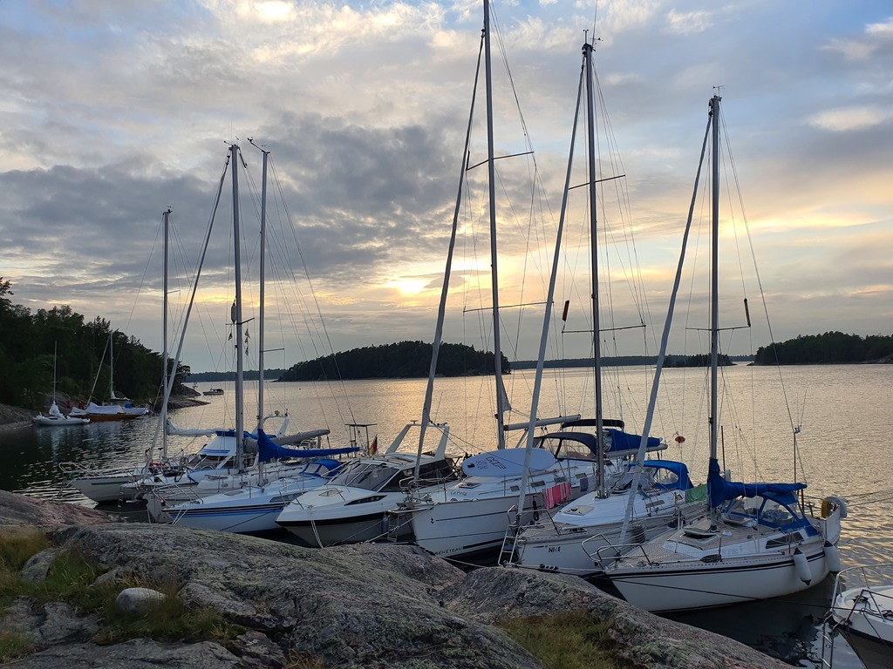

Today was Suski's first work day after the summer vacation. Bergie resupplied the boat with water and cheese, and it was time to sail out of the Archipelago Sea.

 

Most of today was a comfortable beam reach, though rounding the Cape Hanko took a bit of tacking with the southerly wind.

 

In the evening we arrived to the nature harbour of Byxholmen. This is one of the UUVI nature sites, and there is even a sauna on the island. The harbour was quite packed, but we managed to squeeze ourselves between two motorboats. Then later a smaller sailboat arrived, and we managed to fit also that into the gap. Peak season indeed! This spot has three buoys, and about ten boats (we're on stern anchor).

* Distance today: 36.4NM
* Total distance: 1432.4NM
* Engine hours: 0.2
* Lunch: feta salad
