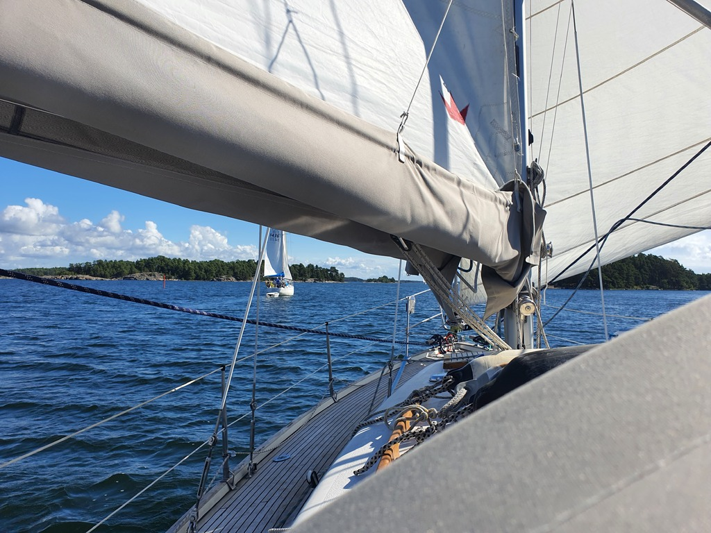

The morning departure from Byxholmen started with a bit of hassle - a boat had tied to a buoy across our anchor line. But we managed to sort it out with the boat's crew. Then back to the fairway and sails up, while the office worker went below for a full day of meetings.

 

Sailing was fast but a bit tricky, alternating between dead downwind and beam reach on a pretty narrow fairway. But we did pass more boats than did pass us!

It was a relief to get to the open water part in the Bay of Porkkala where one could actually set a course and chill for an hour or two. After rounding the Cape Porkkala we pulled into the city of Helsinki recreational area of Lähteelä where there is a convenient small marina. Tomorrow we'll pick up crew here.

* Distance today: 37NM
* Total distance: 1469.4NM
* Engine hours: 0.6
* Lunch: spinach and forest mushroom quiche
