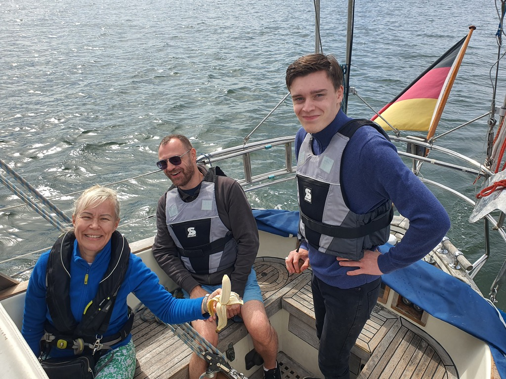

Lunch break was with quite lovely salmon soup at the café. In the afternoon our British crew came onboard. We did the usual briefings, and then went out to explore the nearby archipelago a bit.

Quite light winds. The 100° shift meant that the way back was tacking. Good practice for the novice steersman!
 

Lähteelä was packed when we returned, but we still found a spot in the land end of the pier. Some sundowners and barbecue followed.

* Distance today: 13.7NM
* Total distance: 1483.1NM
* Lunch: salmon soup
