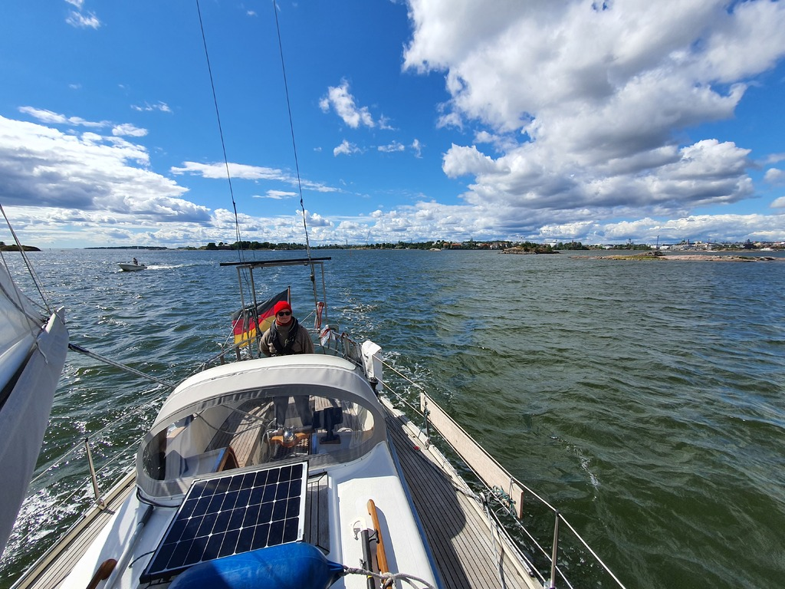

The morning started with waiting for our neighbours to leave. Our buoy was quite near the shore and it had a rock right behind it, so we wanted to leave as much space as possible around us for some rope manouvering. The manouver was smooth and soon we had our sails up. 

 

We took the inner fairway towards Helsinki and enjoyed the varied winds. At times the wind funneled between the islands and gave us some proper speed on beam reach. We rounded Suomenlinna from the north and were once again navigating between all the different ferries going to all the sites on the islands. We took berth at HMVK and had had some family visiting us.

* Distance today: 22.7NM
* Total distance: 1505.8NM
* Engine hours: 0.6
