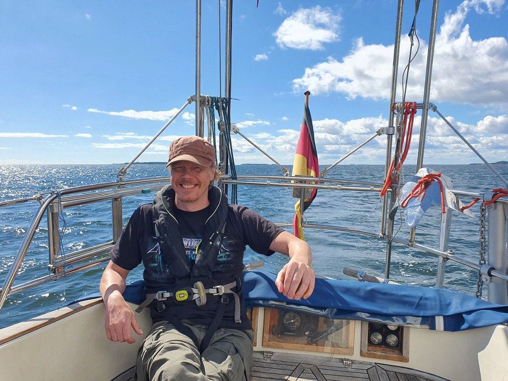
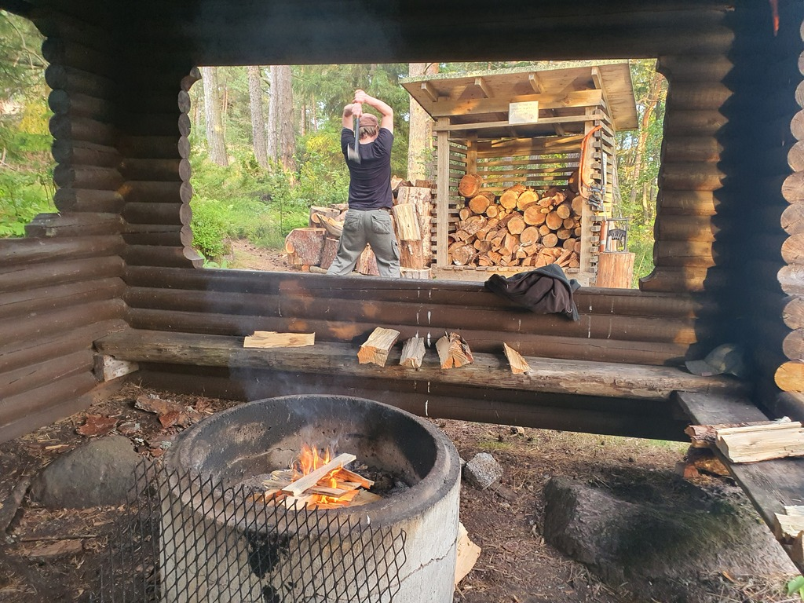

Some morning logistics plus visitors, then at noon we sailed out of Helsinki. This time the Kuninkaansalmi strait was easy with a broad reach. Wing-on-wing to the east with low winds, no waves, and a nice sunshine.

 

After we passed the Vuosaari harbour fairway the onshore clouds caught up with us and brought a moment of heavy rain and high winds. We switched to beam reach (bacon saved by a preventer yet again) and zoomed along.

 

Once the rain was gone, it was back to quite slow but pleasant wing-on-wing. We eventually pulled to the Äggskar islands. This is a recreational area from the city of Porvoo, and so we had some barbeque and sundowners.

* Distance today: 27.8NM
* Total distance: 1533.6NM
* Engine hours: 0.5
* Lunch: forest mushroom risotto
