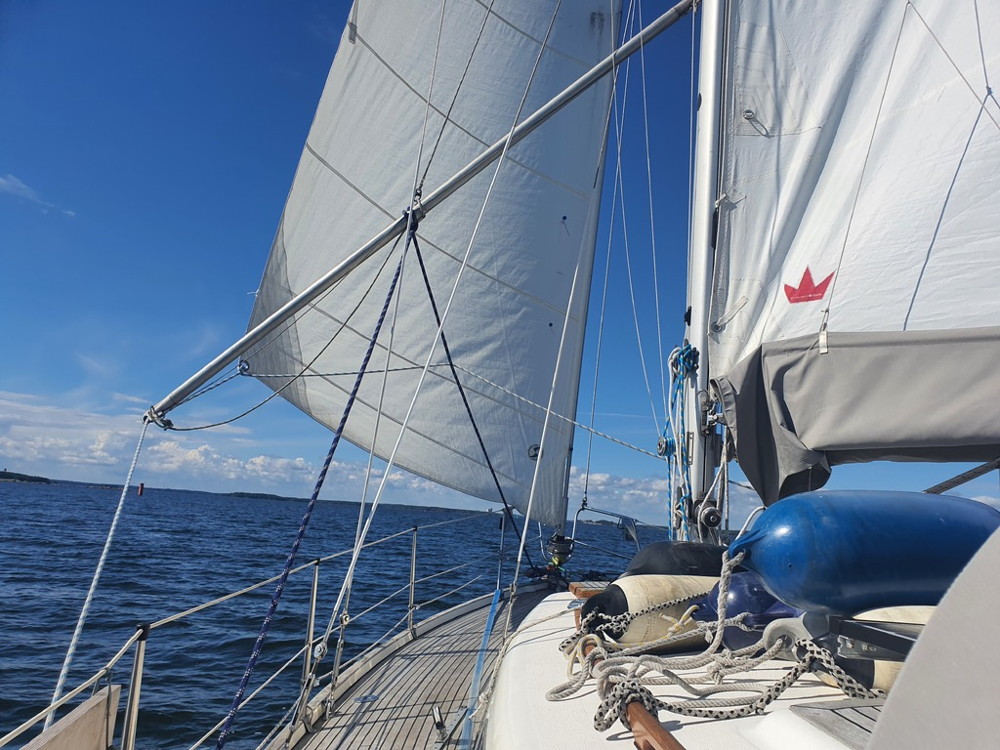
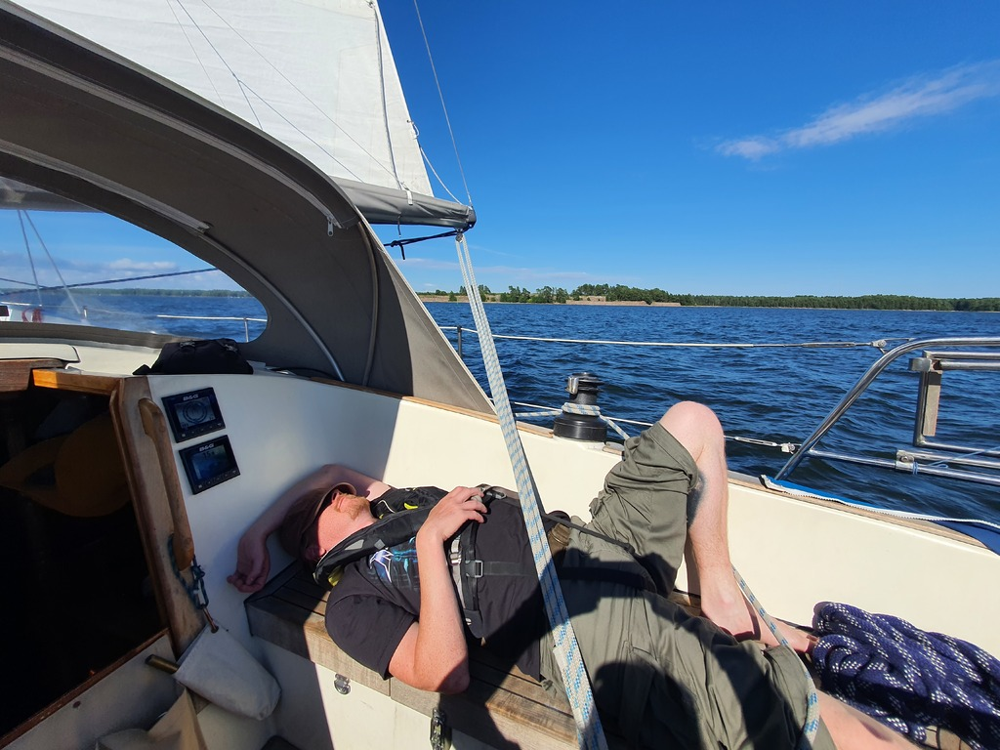

After morning coffee we detached ourselves from the buoy and headed to the inner fairway. First two hours were light winds as forecasted, and we ghosted along at 2kt.

When we reached the Suni straits, the wind picked up a bit. We managed to pass the cable ferry on a broad reach, and then carried on. We then took the outer route towards Loviisa, as the winds ought to be a bit better there.

 

We arrived to Loviisa yet again wing-on-wing, and dropped sail at the point before the fairway becomes super shallow. Everything went smoothly except that for the first time ever, the engine was reluctant to start. Something to debug tomorrow.

 

In the nearly empty guest harbour we had a dinner with some of Suski's family.

* Distance today: 29.8NM
* Total distance: 1563.4NM
* Engine hours: 0.9
* Lunch: feta salad
