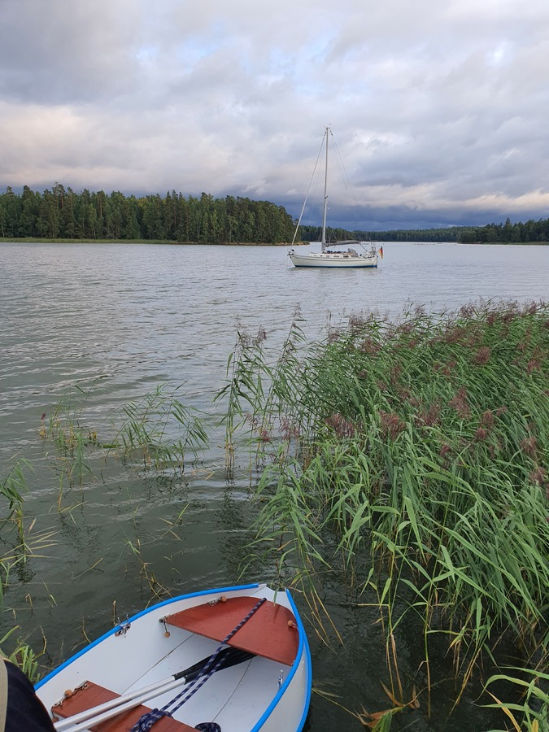

Another start of a work week, so the off-watch visited the Loviisa maritime museum. Then lunch and some engine checks. Everything seemed ok, so we decided to do today's short run under engine to exercise it a bit.

 

After three hours of dodging rocks, we arrived to a friend's summer cottage. We'll spend a while here before starting out trip back towards western Finland, Sweden, and eventually Berlin.

* Distance today: 15.5NM
* Lunch: new potatoes and freshly picked chanterelles
