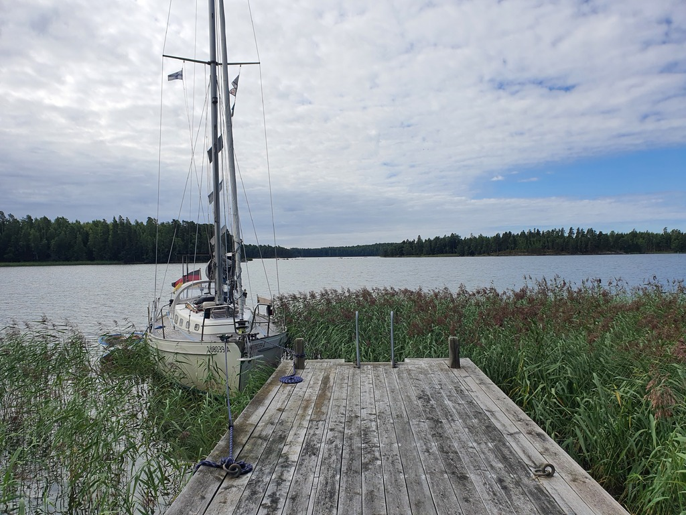

Yesterday when we arrived, we decided to use the bow anchor and stay between the shore and the fairway.

After arriving we took the dinghy out and took soundings of the last 50 meters to the pier with a lead line. No accurate chart data available for this bay. Based on our findings we were happy enough to try to tie our bow to the pier. So up with the bow anchor, a new approach and drop the anchor from the stern! 

 

* Distance today: 0.1 NM
* Total distance: 1579 NM
* Engine hours: 0.3
* Lunch: tomato salad with fried potatoes
