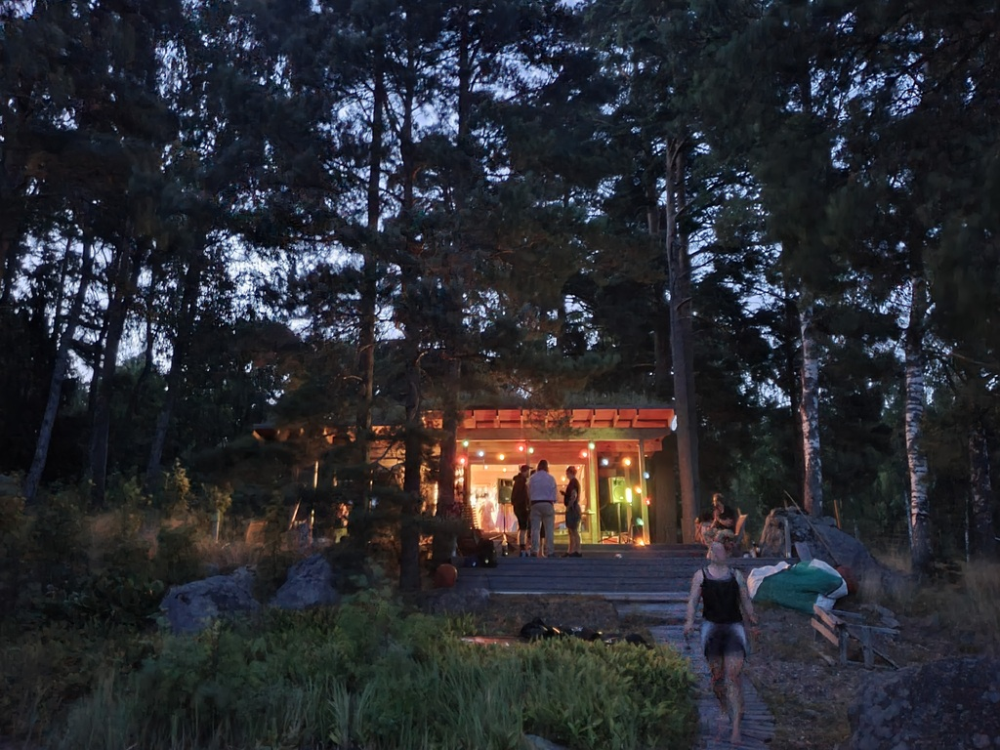
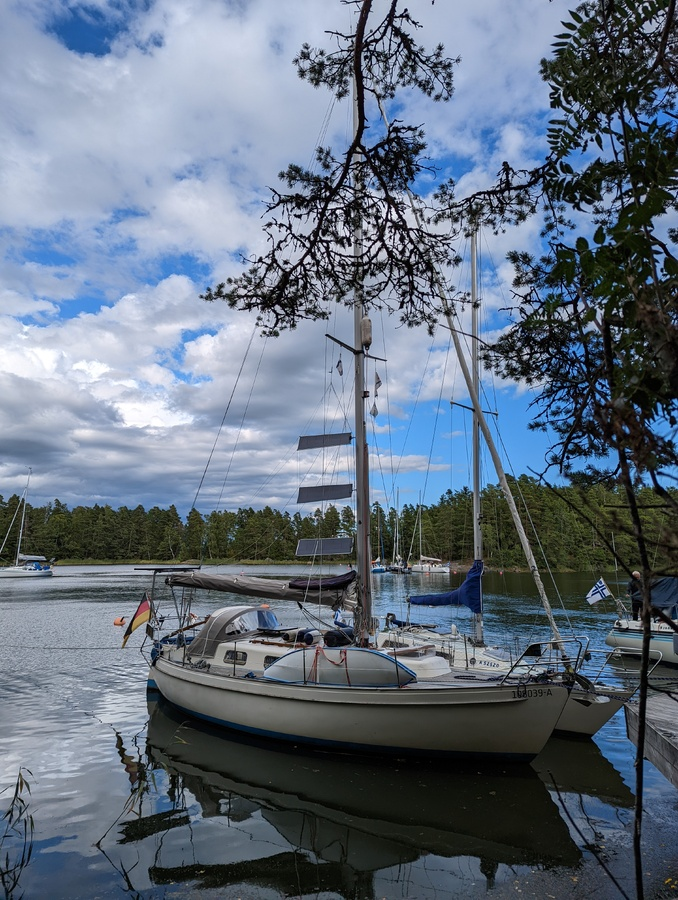

The week at the cottage was a lot of fun - sauna, hot tub, karaoke, old friends, and even a live concert by Domra Cocktail.

 

Yesterday there was a gale blowing through the anchorage, and that made our stern anchor drag a bit in the soft clay. We stabilized the situation by setting a second anchor. But despite that, it was time to move to a more protected spot today.

 

We hoisted anchors and sailed for maybe half an hour to the nearby nature harbour of Bockhamn. Here we have good wind protection from all sides, which is something you want with forecasted thunder squalls. We also did a bit of maintenance on the depth sounder. Tomorrow starts the trip home!

* Distance today: 4.3NM
* Total distance: 1583.3NM
* Engine hours: 1.2
* Lunch: coconut curry lentil soup
