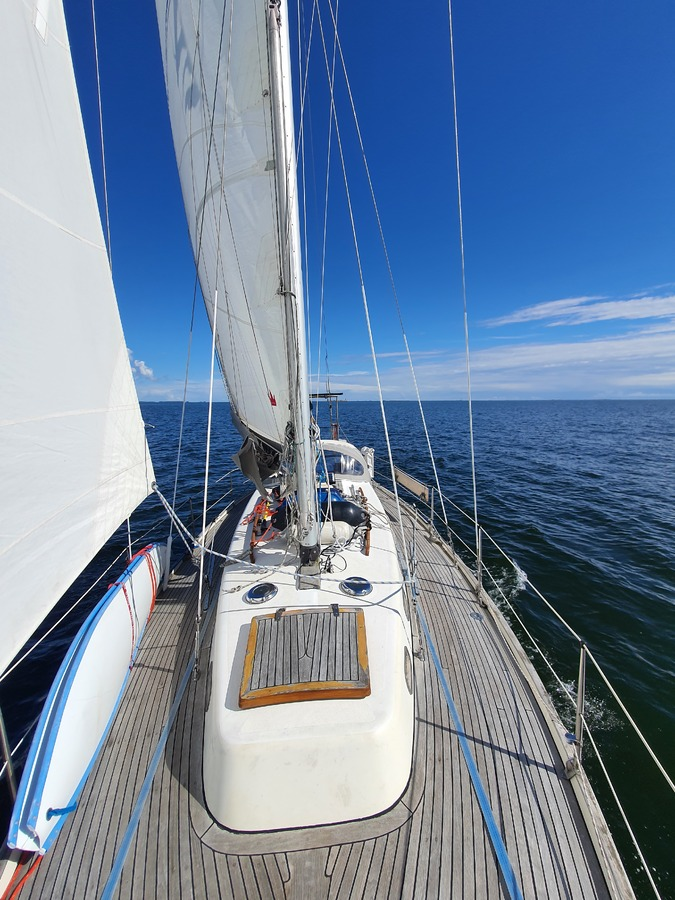
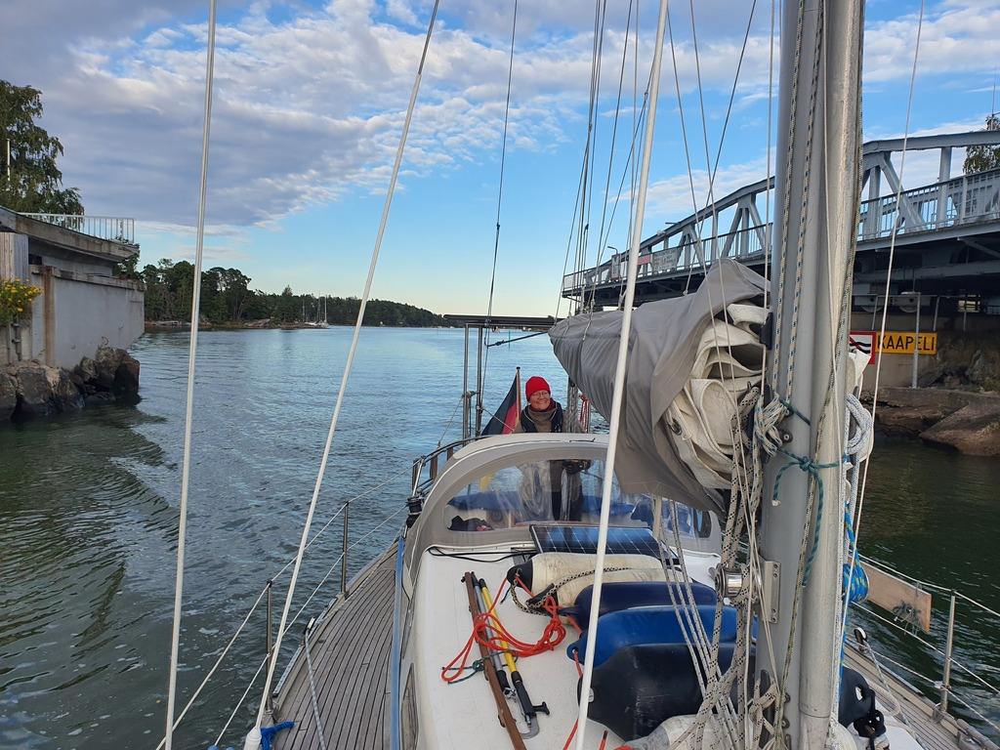

After several days of high winds, today dawned with a total windstill. After breakfast we left the pier at the nature harbour and started motoring towards the narrow Suni strait. At least we could motor to a different nature harbour, we thought.

When we reached the west side of the island of Pellinki, a light breeze picked up. Enough to sail, albeit slowly. But as the fairway is pretty wide in the area, this allowed nice long lazy tacks.

 

Once we passed Cape Emäsalo the wind picked up a bit and the sun came out. Suddenly we were actually doing quite enjoyable 5kt on a beam reach. At that point we revised out target and decided to head to Helsinki already today. This should provide a bit more time for seeing friends and acquiring provisions.

 

The wind died again when we passed Vuosaari, and so we motored to the Hevossalmi turning bridge. This is a handy shortcut to Helsinki from the east. The bridge opens every half an hour during daytime. We're tied up at the by now familiar HMVK pier.

* Distance today: 36.7NM
* Total distance: 1620NM
* Engine hours: 3.3
* Lunch: feta oven pasta
