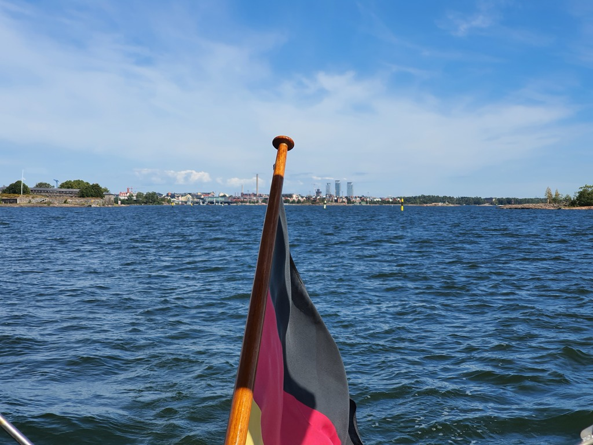
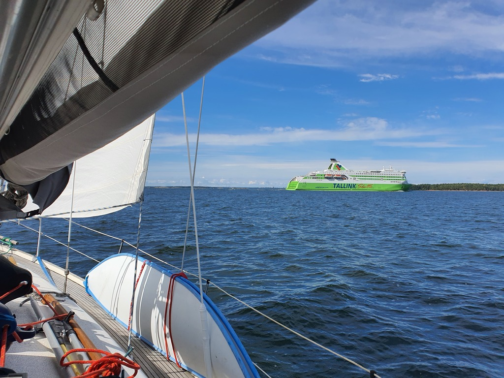

Having resupplied the boat, it was time to move on. The forecast was quite nice wind, albeit on the nose. We left HMVK at 10:30, and hoisted sail immediately after rounding Katajanokka. Some dodging of Suomenlinna ferries followed, but we got out of Helsinki with just a few tacks.

 

Tacking continued southwest. Thanks to the wide fairways,  and various spaces between rocks, we were able to do some pretty long continuous runs. What a nice weather! For once, all boats out were sailing instead of motoring.

 

We pulled into the Lähteelä marina yet again. Some barbeque tonight, and hopefully salmon soup tomorrow. We'll meet some friends here and then continue the trip on Friday.

* Distance today: 28.5NM
* Total distance: 1648.5NM
* Engine hours: 1
* Lunch: feta salad
