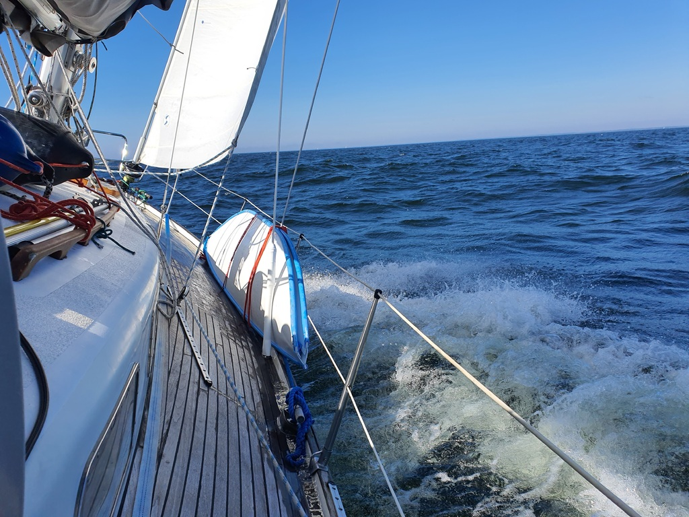

Today's sail promised and delivered a lot of tacking in small spaces. Bergie got his exercise while Suski was steering. Sailing in Havel proves to be a good training ground for the archipelago, as we know how to tack efficiently and where we should be in relation to oncoming traffic.

We crossed the Bay of Porkkala close reached and were pounding against the swell. No way this is a crossing you do on a work day! The decision to go out with the first reef in proved to be the correct one. At the very end we could adjust the course and get a nice beam reach and the best speeds of the day. 

 

For the narrow Barösund strait we dropped sails and motored the remaining 2.5 NM with wind dead on the nose. For the harbour we had a nasty side wind. We caught the buoy, threw the lines over to the pier and were secure for about 2 second until the buoy hook came off and Suski backed away from the pier with a very loud PERKELE. So we got to do the whole manouver twice! I think this also means 2 anlegers!

* Distance today: 21.1NM
* Total distance: 1669.6NM
* Engine hours: 0.9
* Breakfast: french omelette
