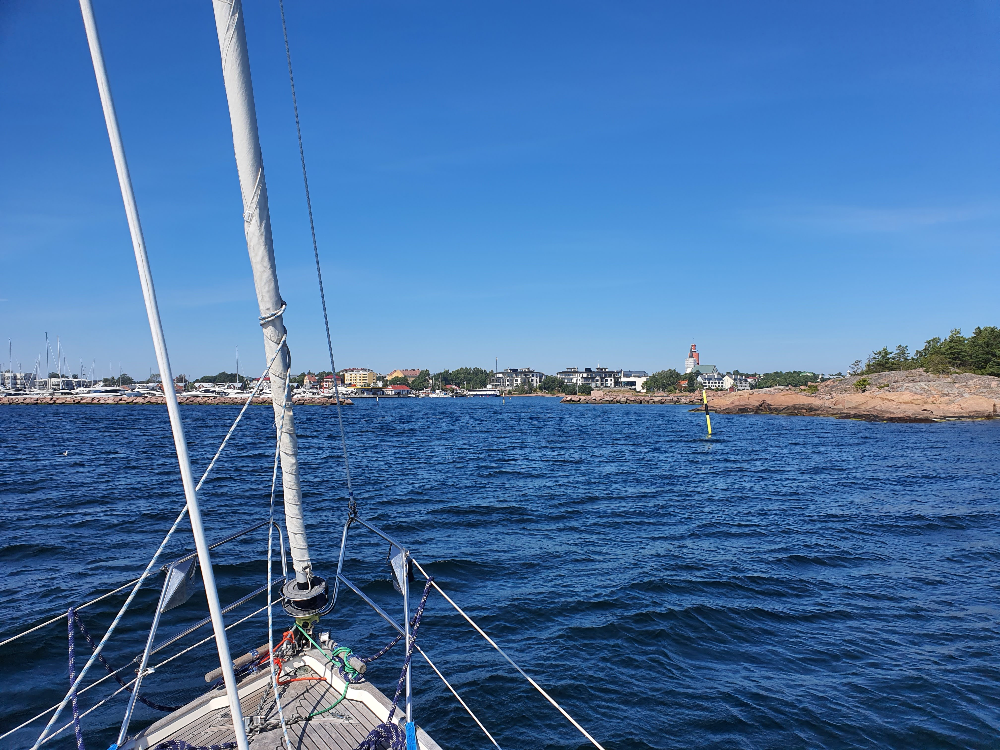

Today's main mission was to avoid the oncoming traffic from a powerboat event in Hanko, so we chose the outer route. Wind was broad or beam reach and we made some solid progress. When we joined the inner fairway we were greeted with a near endless flow of powerboats going full speed towards their home harbours. So deafening motor roars and massive waves were encountered proving us right to go initially on the outside route!

 

We called in Hanko harbour and got instructions not to arrive before 1400. As we arrived to the harbour exactly at 1400 we got to enjoy a completely empty west side of the wooden pier. We chose a buoy in the middle of the pier and headed for a well deserved pizza.

* Distance today: 16.6NM
* Total distance: 1703.2NM
* Engine hours: 0.7
* Lunch: feta avocado salad
