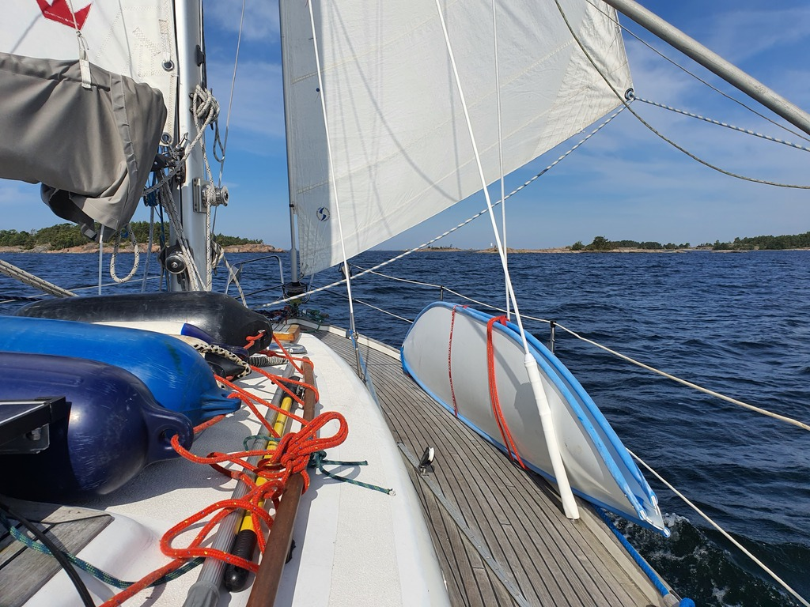
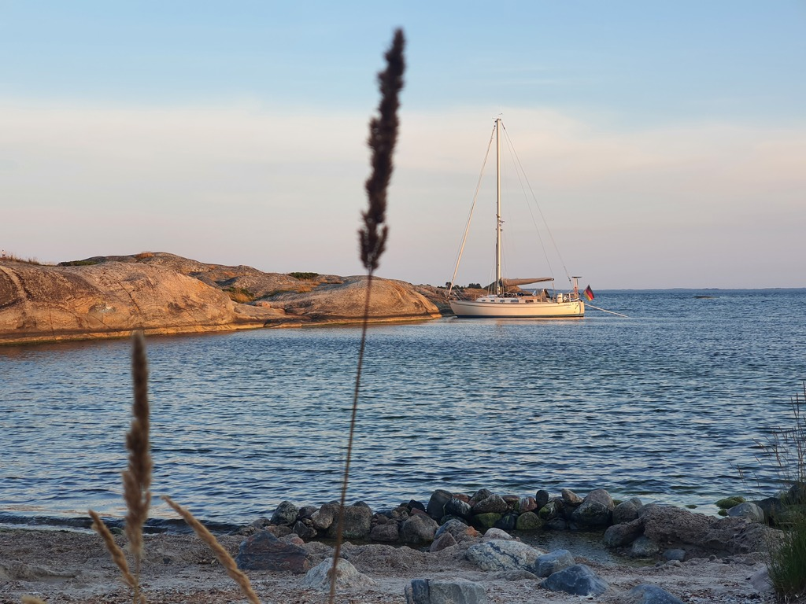

We left our weekend crew to Hanko. Now the local sailing season is practically over - it was weird to see this normally busy marina almost empty.

This week we have some rare east wind, which suits us perfectly as we're headed west. Today's mission was to get us back to the Archipelago Sea.

 

We left Hanko after breakfast, and rounded the Cape on a nice broad reach. Then dead downwind over the bay of Hanko, and past the other normally busy today deserted marina of Kasnäs. I didn't count a single boat in the guest piers!

 

Once the German-time workday was over we did a watch change and Suski sailed us to the extremely pretty nature harbour of Kråkskär. Not the easiest place to arrive to with the steep cliffs. We explored the island a bit before a sunset swim.

* Distance today: 38.3NM
* Total distance: 1741.5NM
* Engine hours: 0.5
* Lunch: spaghetti with avocado sauce
