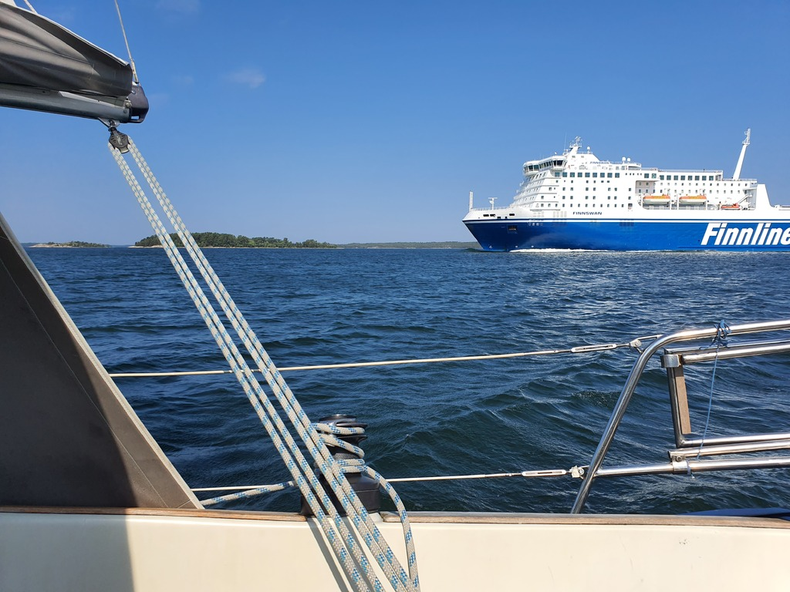

The island of Kråkskär was just as pretty in the morning sun as it had been at sunset. But also almost completely devoid of Internet. As Tuesday is a workday, this meant an early departure.

We decide to route ourselves to Korppoo, as it lies on the archipelago ring road, allowing for some last family visits before it is time to leave Finland behind.

 

The route winded through the rocky national park through lots of scenic narrow fairways. Wind directions alternated between broad reach and dead downwind, making this easy work.

 

Once we reached the inner islands, the wind piped up. At up to 25kt, other boats were busy reefing. Unlike yesterday's marinas, the Korppoo guest harbour was surprisingly almost full. We're now on a mooring ball at the pier head.

* Distance today: 29.5NM
* Total distance: 1771NM
* Engine hours: 1.1
* Lunch: couscous salad
