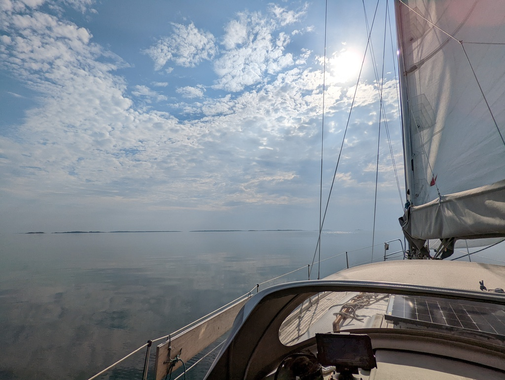
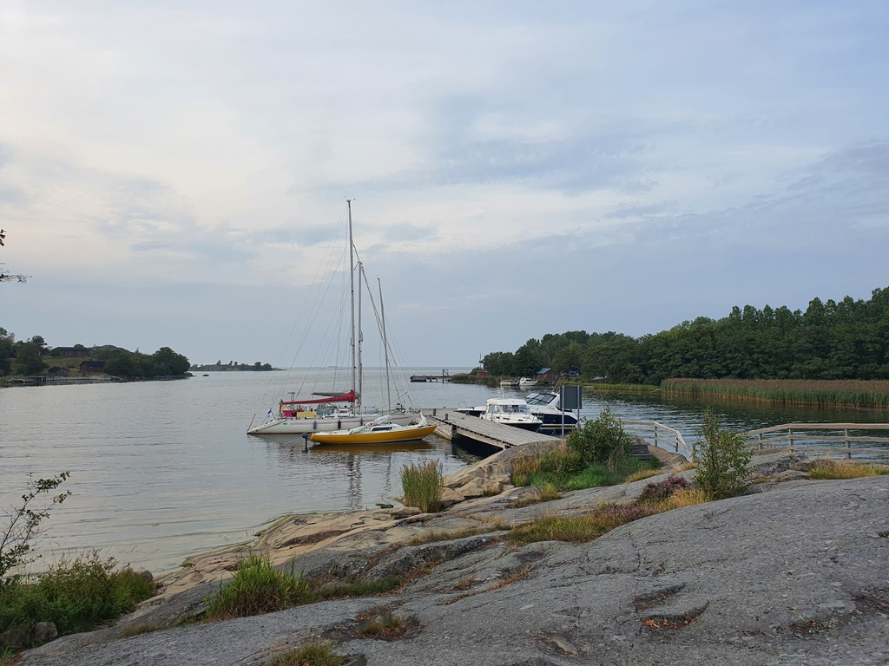

The day dawned with almost no wind. But no matter, we still wanted to proceed westwards. Easterlies were forecasted for the next couple of days, and it would be a shame not to utilize them.

In the first eight hours we sailed just ten nautical miles. Then we did a watch change, and saw a seal sunning itself on some rocks next to the fairway.

 

Once the evening batch of ferries from Stockholm had passed us, we finally gave up and started motoring - at that point Navionics estimated we'd be at our designated nature harbour in four days. Under engine, that turned into less than two hours.

At Jungfruskär we dropped stern anchor and tied our nose to the pier. Then we joined some other people at the fire pit for some grilling, beverages, and sea stories.

 

Around 3am a thunderstorm rolled over us with gusts of 50kt. Anchor failed on the windward boat on the pier, pressing it to the middle boat, which dragged anchor and got pressed into us. So for a while we had three boats held with our anchor. Thankfully it held. Another lesson of always anchoring with enough scope even if weather is not expected!

* Distance today: 17.7NM
* Total distance:  1788.7NM
* Engine hours: 2
* Lunch: pea soup
