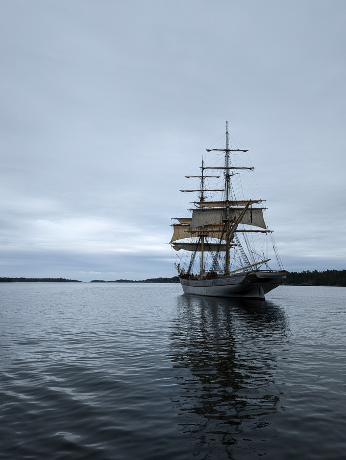
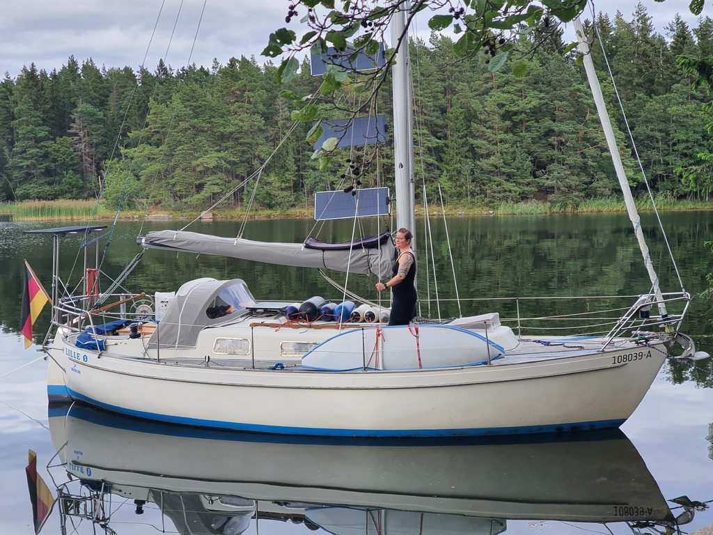

Rainy bleak morning without wind. And yet, we decided we've spent enough time in this nature harbour. It was time to move on. Motoring to the next spot would also help a little bit with our batteries having been depleted quite a bit over the mostly-overcast last week.

 

Right outside our anchorage we passed the square-rigged brig Tre Kronor af Stockholm that was slowly drifting forwards while hoisting sails. A little after a seal dived near our boat.

We motored through the Furusund straits following the main Stockholm fairway. We picked the nature harbour of Stor-Asken as the spot for the night. Our first point on land was deemed a bit shallow in case there would be waves later, and so we re-anchored to a better spot. Now there is 1.7m of water under us with bow attached to land. Cozy!

 

* Distance today: 13.3NM
* Total distance: 1868.2NM
* Engine hours: 3.3
* Lunch: spaghetti Bolognese
