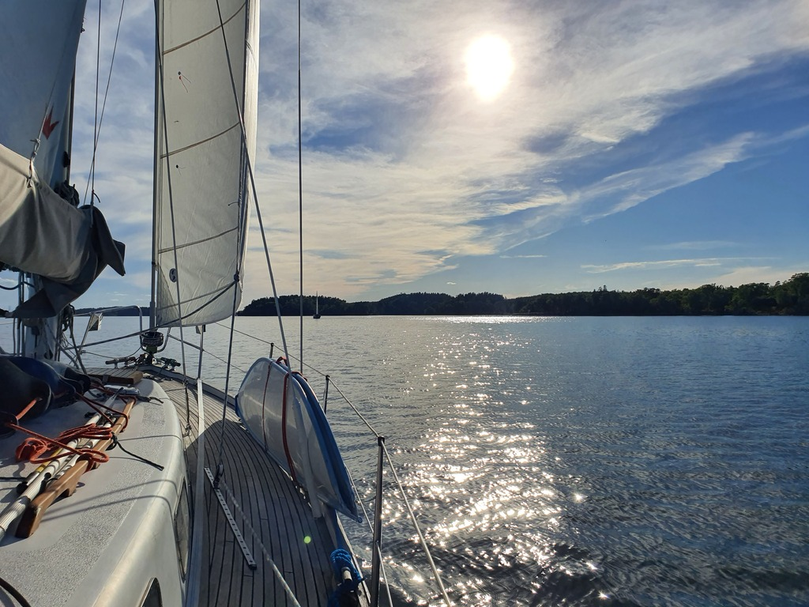
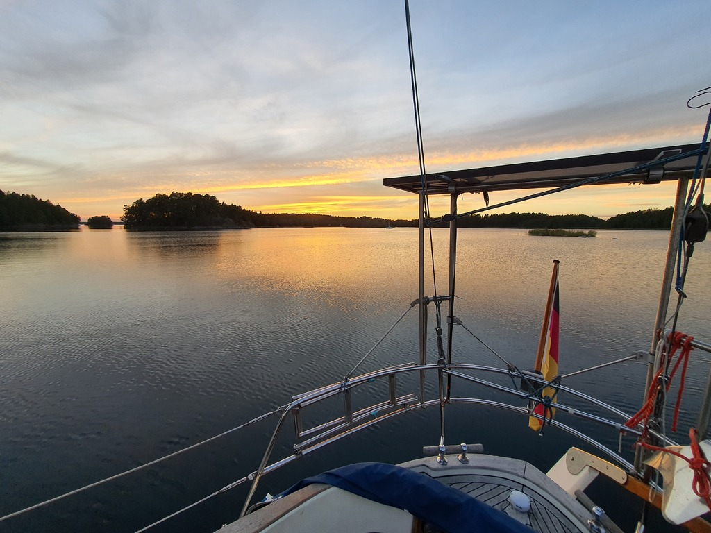

We sat at anchor until noon waiting for wind and charging our batteries via solar. Then anchor up and under way.

 

The wind was mostly light and from variable directions as we tacked up the main Stockholm fairway, dodging an occasional cruise liner.

After the workday the wind died and we decided to motor to the next nature harbour, as nowadays sun sets early. As it happened, we dropped hook just ten minutes before sunset. Beautiful bay with multiple other German and Swedish vessels anchored.

 

* Distance today: 25.7NM
* Total distance: 1893.9NM
* Lunch: feta avocado salad
