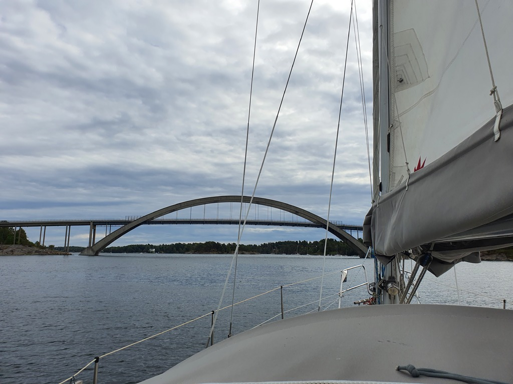
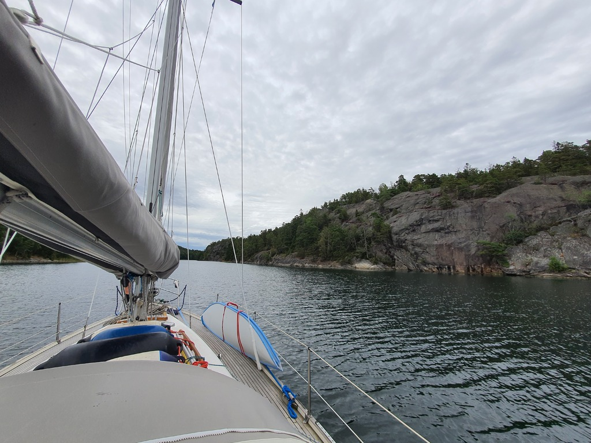

Another low wind day, so about half of it with motor. We hoisted anchor after breakfast and tacked through the shortcut at Älgöfjärd straits. There was a bit of motorsailing involved to clear a bridge there.

 

Then we met our previous track from late May sailing past the island of Nämdö where we found a sauna back then. This time it was with wing on wing with overcast skies.

Turning towards Stockholm the wind went from 8kt to 0kt in an instant, and we motored the remaining bit to the spectacular nature harbour of Napoleon Bay. Here we're safely Scandic moored between some impressively high cliffs. We'll stay here for a day or two, depending how the internet holds up.

 

* Distance today: 23.2NM
* Total distance: 1917.1NM
* Engine hours: 2.5
* Lunch: spaghetti with tomato sauce
