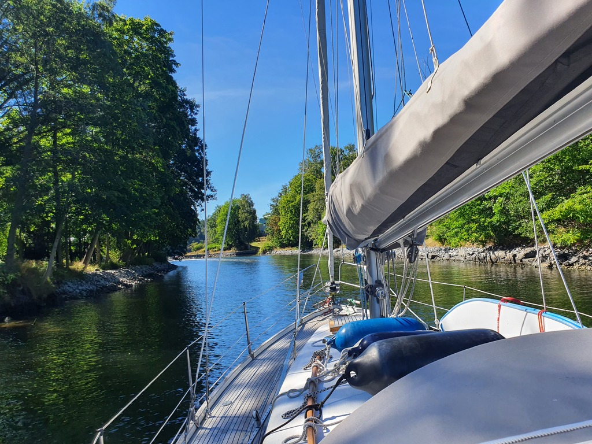

Another day without wind. But we still hoisted anchor and motored on the narrow - very narrow - channel towards Stockholm.

 

We're now docked near the Vasa Museum. We'll pick up crew here, do a bit of tourism, and then continue our adventure to the south.

* Distance today: 15.6 NM
* Total distance: 1932.7 NM
* Engine hours: 4.2
* Lunch: feta chanterelle börek
